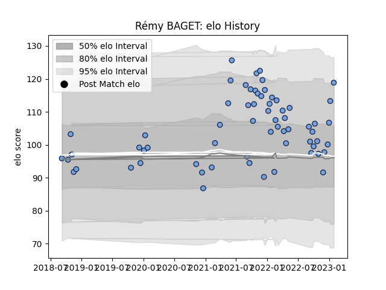

---  
layout: page  
title: Rémy BAGET  
date: 2023-02-05 17:59:00.712651  
categories: player  
---
# Rémy BAGET

## Positions: W

## Current elo: 117.0

## Current Percentile: 92.0

# Elo History

# Match History

| Team    |   Appearances |   Win Rate |
|:--------|--------------:|-----------:|
| Bayonne |            67 |   0.567164 |

| Opponent             |   Matches |   Win Rate |
|:---------------------|----------:|-----------:|
| Toulon               |         4 |   0.5      |
| Bordeaux Begles      |         4 |   0.25     |
| Agen                 |         3 |   0.5      |
| Montauban            |         3 |   1        |
| Mont-de-Marsan       |         3 |   0.333333 |
| Stade Toulousain     |         3 |   0.666667 |
| Carcassonne          |         3 |   0.333333 |
| Vannes               |         3 |   1        |
| Beziers              |         3 |   0.333333 |
| Oyonnax              |         3 |   0.333333 |
| US Bressane          |         2 |   1        |
| Nevers               |         2 |   0.75     |
| Stade Francais Paris |         2 |   0        |
| Scarlets             |         2 |   0        |
| Rouen                |         2 |   1        |
| Racing 92            |         2 |   1        |
| Provence Rugby       |         2 |   0.5      |
| Narbonne             |         2 |   1        |
| Aurillac             |         2 |   1        |
| Montpellier Herault  |         2 |   0        |
| Grenoble             |         2 |   0.5      |
| Colomiers            |         2 |   0.5      |
| Brive                |         2 |   0.5      |
| Pau                  |         1 |   0.5      |
| Perpignan            |         1 |   1        |
| Lyon                 |         1 |   1        |
| London Irish         |         1 |   1        |
| Leicester Tigers     |         1 |   0        |
| Soyaux-Angouleme     |         1 |   1        |
| La Rochelle          |         1 |   1        |
| Castres Olympique    |         1 |   0        |
| Zebre                |         1 |   0.5      |