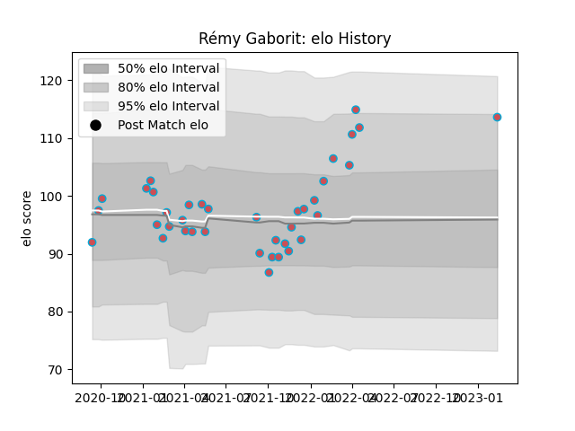

---  
layout: page  
title: Rémy Gaborit  
date: 2023-03-16 20:16:06.021314  
categories: player  
---
# Rémy Gaborit

## Positions: P

## Current elo: 118.0

## Current Percentile: 90.0

# Elo History

# Match History

| Team             |   Appearances |   Win Rate |
|:-----------------|--------------:|-----------:|
| Bourgoin-Jallieu |            39 |   0.435897 |

| Opponent                   |   Matches |   Win Rate |
|:---------------------------|----------:|-----------:|
| Tarbes                     |         5 |   0.4      |
| Massy                      |         4 |   0.25     |
| Albi                       |         3 |   0.333333 |
| Blagnac                    |         3 |   0.666667 |
| Chambery                   |         3 |   0.666667 |
| Dax                        |         3 |   0        |
| Dijon                      |         3 |   1        |
| Nice                       |         3 |   0.333333 |
| Suresnes                   |         3 |   0.666667 |
| Aubenas                    |         2 |   0.5      |
| Cognac Saint Jean d'Angély |         2 |   0.5      |
| Valence Romans Drome Rugby |         2 |   0.5      |
| Narbonne                   |         1 |   0        |
| Soyaux-Angouleme           |         1 |   0        |
| US Bressane                |         1 |   0        |