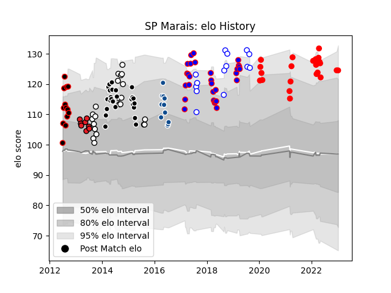

---  
layout: page  
title: SP Marais  
date: 2023-01-13 11:31:31.615976  
categories: player  
---
# SP Marais

## Positions: FB, W

## Current elo: 125.0

## Current Percentile: 91.0

# Elo History

# Match History

| Team                   |   Appearances |   Win Rate |
|:-----------------------|--------------:|-----------:|
| Stormers               |            29 |   0.413793 |
| Sharks                 |            26 |   0.576923 |
| Yokohama Canon Eagles  |            23 |   0.521739 |
| Natal Sharks           |            22 |   0.704545 |
| Western Province       |            14 |   0.642857 |
| Eastern Province Kings |            13 |   0.923077 |
| Bulls                  |            11 |   0.636364 |
| Southern Kings         |             8 |   0.25     |

| Opponent                          |   Matches |   Win Rate |
|:----------------------------------|----------:|-----------:|
| Bulls                             |         9 |   0.333333 |
| Cheetahs                          |         9 |   0.666667 |
| Lions                             |         7 |   0.571429 |
| Pumas                             |         7 |   0.571429 |
| Golden Lions                      |         7 |   0.714286 |
| Free State Cheetahs               |         7 |   0.642857 |
| Blue Bulls                        |         6 |   1        |
| Stormers                          |         6 |   0.333333 |
| Chiefs                            |         5 |   0.4      |
| Saitama Wild Knights              |         4 |   0        |
| Kobelco Kobe Steelers             |         4 |   0.25     |
| Sharks                            |         4 |   0.25     |
| Griquas                           |         4 |   0.5      |
| Highlanders                       |         4 |   0.25     |
| Crusaders                         |         4 |   0.25     |
| Queensland Reds                   |         3 |   0.666667 |
| Western Force                     |         3 |   1        |
| New South Wales Waratahs          |         3 |   0.333333 |
| Western Province                  |         3 |   0.333333 |
| Jaguares                          |         3 |   0.666667 |
| Blues                             |         3 |   0.666667 |
| Hurricanes                        |         3 |   0.333333 |
| Green Rockets Tokatsu             |         3 |   1        |
| SWD Eagles                        |         2 |   1        |
| Valke                             |         2 |   1        |
| Tokyo Sungoliath                  |         2 |   0        |
| Sunwolves                         |         2 |   0.5      |
| Boland Cavaliers                  |         2 |   1        |
| Southern Kings                    |         2 |   1        |
| Border Bulldogs                   |         2 |   1        |
| Brumbies                          |         2 |   0        |
| Eastern Province Kings            |         2 |   1        |
| Griffons                          |         2 |   1        |
| Natal Sharks                      |         2 |   0.5      |
| Melbourne Rebels                  |         2 |   1        |
| Black Rams Tokyo                  |         2 |   1        |
| Kubota Spears Funabashi Tokyo-Bay |         1 |   1        |
| Shizuoka Blue Revs                |         1 |   1        |
| NTT Docomo Red Hurricanes Osaka   |         1 |   1        |
| Mitsubishi Dynaboars              |         1 |   1        |
| Mie Honda Heat                    |         1 |   0        |
| Toshiba Brave Lupus Tokyo         |         1 |   0        |
| Toyota Verblitz                   |         1 |   1        |
| Urayasu D-Rocks                   |         1 |   1        |
| Leopards                          |         1 |   1        |