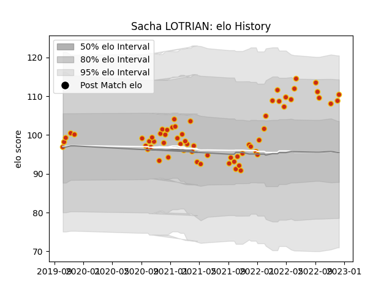

---  
layout: page  
title: Sacha LOTRIAN  
date: 2023-03-04 11:39:50.706006  
categories: player  
---
# Sacha LOTRIAN

## Positions: P

## Current elo: 109.0

## Current Percentile: 83.0

# Elo History

# Match History

| Team      |   Appearances |   Win Rate |
|:----------|--------------:|-----------:|
| Perpignan |            62 |   0.620968 |

| Opponent                   |   Matches |   Win Rate |
|:---------------------------|----------:|-----------:|
| Biarritz Olympique         |         5 |   0.8      |
| Mont-de-Marsan             |         4 |   1        |
| Aurillac                   |         3 |   0.833333 |
| Brive                      |         3 |   0.333333 |
| Soyaux-Angouleme           |         3 |   1        |
| Grenoble                   |         3 |   1        |
| La Rochelle                |         3 |   0.333333 |
| Racing 92                  |         3 |   0.333333 |
| Pau                        |         3 |   0        |
| Oyonnax                    |         2 |   1        |
| Valence Romans Drome Rugby |         2 |   1        |
| Stade Toulousain           |         2 |   0.5      |
| Stade Francais Paris       |         2 |   0        |
| Rouen                      |         2 |   0.5      |
| Provence Rugby             |         2 |   1        |
| Montauban                  |         2 |   0.5      |
| Nevers                     |         2 |   1        |
| Montpellier Herault        |         2 |   0        |
| Colomiers                  |         2 |   0.5      |
| Castres Olympique          |         2 |   0        |
| Carcassonne                |         2 |   1        |
| Bordeaux Begles            |         2 |   0.5      |
| Vannes                     |         2 |   1        |
| Beziers                    |         1 |   0        |
| Lyon                       |         1 |   0        |
| Clermont Auvergne          |         1 |   1        |
| Toulon                     |         1 |   1        |