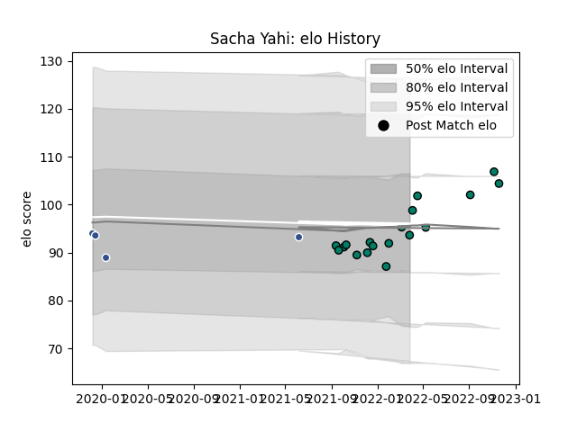

---  
layout: page  
title: Sacha Yahi  
date: 2023-03-06 11:26:25.719604  
categories: player  
---
# Sacha Yahi

## Positions: L

## Current elo: 94.0

## Current Percentile: 49.0

# Elo History

# Match History

| Team     |   Appearances |   Win Rate |
|:---------|--------------:|-----------:|
| Suresnes |            18 |   0.444444 |
| Agen     |             4 |   0        |

| Opponent                   |   Matches |   Win Rate |
|:---------------------------|----------:|-----------:|
| Aubenas                    |         2 |        0.5 |
| Bordeaux Begles            |         2 |        0   |
| Chambery                   |         2 |        0   |
| Dijon                      |         2 |        1   |
| Nice                       |         2 |        0.5 |
| Tarbes                     |         2 |        1   |
| Albi                       |         1 |        0   |
| Bourgoin-Jallieu           |         1 |        0   |
| Dax                        |         1 |        1   |
| Lyon                       |         1 |        0   |
| Massy                      |         1 |        0   |
| Rennes                     |         1 |        1   |
| Soyaux-Angouleme           |         1 |        0   |
| US Bressane                |         1 |        0   |
| Valence Romans Drome Rugby |         1 |        0   |
| Wasps                      |         1 |        0   |