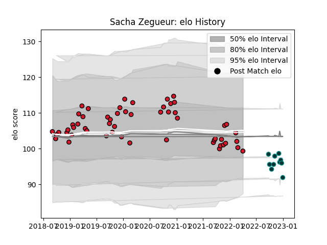

---  
layout: page  
title: Sacha Zegueur  
date: 2023-01-06 00:19:40.142189  
categories: player  
---
# Sacha Zegueur

## Positions: FL

## Current elo: 99.0

## Current Percentile: 44.0

# Elo History

# Match History

| Team    |   Appearances |   Win Rate |
|:--------|--------------:|-----------:|
| Oyonnax |            56 |      0.625 |
| Pau     |            10 |      0.35  |

| Opponent             |   Matches |   Win Rate |
|:---------------------|----------:|-----------:|
| Beziers              |         6 |   0.666667 |
| Montauban            |         5 |   0.7      |
| Carcassonne          |         5 |   0.8      |
| Provence Rugby       |         5 |   0.8      |
| US Bressane          |         4 |   0.75     |
| Colomiers            |         4 |   0.875    |
| Vannes               |         3 |   0.666667 |
| Bayonne              |         3 |   0.5      |
| Biarritz Olympique   |         3 |   0        |
| Mont-de-Marsan       |         3 |   0.333333 |
| Rouen                |         3 |   0.333333 |
| Grenoble             |         3 |   0.333333 |
| Aurillac             |         2 |   1        |
| Soyaux-Angouleme     |         2 |   1        |
| Nevers               |         2 |   0.5      |
| Stade Francais Paris |         2 |   0        |
| Toulon               |         1 |   0        |
| Perpignan            |         1 |   0        |
| Agen                 |         1 |   1        |
| Montpellier Herault  |         1 |   0        |
| Massy                |         1 |   1        |
| Dragons              |         1 |   1        |
| Cheetahs             |         1 |   0        |
| Castres Olympique    |         1 |   0        |
| Brive                |         1 |   0        |
| Bordeaux Begles      |         1 |   1        |
| La Rochelle          |         1 |   1        |