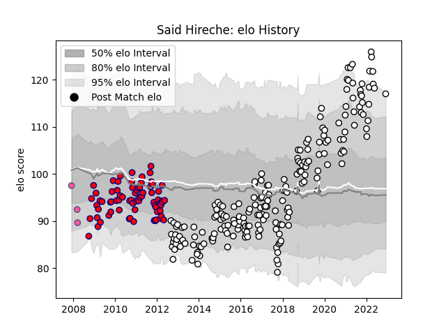

---  
layout: page  
title: Said Hireche  
date: 2022-12-18 16:34:00.334114  
categories: player  
---
# Said Hireche

## Positions: FL

## Current elo: 115.0

## Current Percentile: 94.0

# Elo History

# Match History

| Team                 |   Appearances |   Win Rate |
|:---------------------|--------------:|-----------:|
| Brive                |           201 |   0.514925 |
| Aurillac             |            73 |   0.520548 |
| Stade Francais Paris |             3 |   0.333333 |

| Opponent             |   Matches |   Win Rate |
|:---------------------|----------:|-----------:|
| Pau                  |        19 |   0.473684 |
| La Rochelle          |        13 |   0.307692 |
| Grenoble             |        13 |   0.538462 |
| Clermont Auvergne    |        13 |   0.307692 |
| Lyon                 |        12 |   0.5      |
| Castres Olympique    |        12 |   0.583333 |
| Oyonnax              |        12 |   0.583333 |
| Bordeaux Begles      |        12 |   0.375    |
| Stade Francais Paris |        11 |   0.545455 |
| Toulon               |        11 |   0.545455 |
| Racing 92            |        10 |   0.3      |
| Stade Toulousain     |        10 |   0.3      |
| Agen                 |        10 |   0.5      |
| Montpellier Herault  |         9 |   0.611111 |
| Provence Rugby       |         8 |   0.6875   |
| Narbonne             |         8 |   0.4375   |
| Auch                 |         7 |   0.428571 |
| Mont-de-Marsan       |         6 |   0.333333 |
| Bayonne              |         6 |   0.416667 |
| Beziers              |         6 |   0.666667 |
| Dax                  |         6 |   0.5      |
| Colomiers            |         5 |   0.8      |
| Tarbes               |         5 |   0.8      |
| Biarritz Olympique   |         4 |   0.625    |
| Albi                 |         4 |   0.625    |
| Carcassonne          |         4 |   0.5      |
| Newcastle Falcons    |         4 |   0.75     |
| Perpignan            |         3 |   0.333333 |
| US Bressane          |         3 |   0.666667 |
| RC Enisei            |         3 |   0.666667 |
| Aurillac             |         3 |   0.666667 |
| Worcester Warriors   |         3 |   0.666667 |
| Bourgoin-Jallieu     |         2 |   0.5      |
| Nevers               |         2 |   1        |
| Périgueux            |         2 |   0.5      |
| Vannes               |         2 |   1        |
| Massy                |         2 |   1        |
| Soyaux-Angouleme     |         2 |   1        |
| Connacht             |         2 |   0        |
| Bucuresti            |         2 |   1        |
| Gloucester Rugby     |         1 |   0        |
| Bath Rugby           |         1 |   0        |
| Saint-Etienne        |         1 |   1        |
| Calvisano            |         1 |   1        |
| Montauban            |         1 |   1        |
| Zebre                |         1 |   0        |