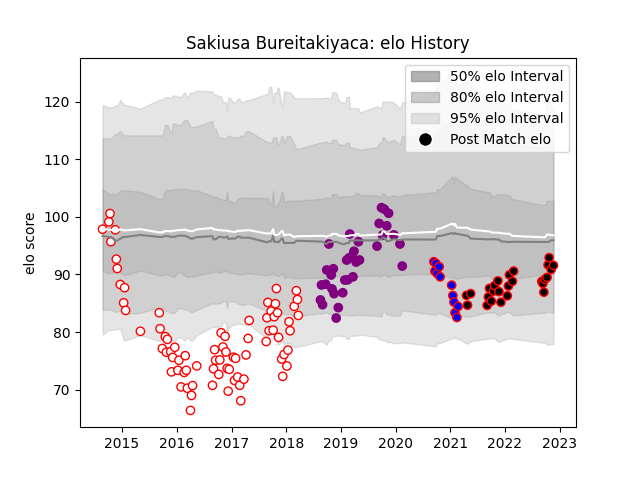

---  
layout: page  
title: Sakiusa Bureitakiyaca  
date: 2022-12-18 16:28:44.360895  
categories: player  
---
# Sakiusa Bureitakiyaca

## Positions: W

## Current elo: 90.0

## Current Percentile: 33.0

# Elo History

# Match History

| Team             |   Appearances |   Win Rate |
|:-----------------|--------------:|-----------:|
| Dax              |            78 |   0.410256 |
| Soyaux-Angouleme |            34 |   0.529412 |
| Nice             |            29 |   0.603448 |
| Dijon            |            12 |   0.25     |

| Opponent                   |   Matches |   Win Rate |
|:---------------------------|----------:|-----------:|
| Narbonne                   |        10 |   0.5      |
| Biarritz Olympique         |        10 |   0.4      |
| Carcassonne                |        10 |   0.25     |
| Montauban                  |         9 |   0.388889 |
| Colomiers                  |         8 |   0.5      |
| Aurillac                   |         7 |   0.714286 |
| Beziers                    |         7 |   0.285714 |
| Bourgoin-Jallieu           |         7 |   0.428571 |
| Mont-de-Marsan             |         6 |   0.333333 |
| Albi                       |         6 |   0.5      |
| Tarbes                     |         6 |   0.5      |
| Soyaux-Angouleme           |         5 |   0.6      |
| Vannes                     |         5 |   0.6      |
| Bayonne                    |         5 |   0.5      |
| Perpignan                  |         5 |   0.4      |
| Provence Rugby             |         4 |   1        |
| Dax                        |         4 |   0        |
| Suresnes                   |         4 |   0.75     |
| Cognac Saint Jean d'Angély |         4 |   0.5      |
| US Bressane                |         4 |   0.25     |
| Massy                      |         3 |   0.666667 |
| Blagnac                    |         3 |   0.666667 |
| Nevers                     |         3 |   0.666667 |
| Oyonnax                    |         3 |   0.333333 |
| Valence Romans Drome Rugby |         2 |   0        |
| Roval Drome XV             |         2 |   0.5      |
| Agen                       |         2 |   0        |
| Chambery                   |         2 |   0.5      |
| Rennes                     |         1 |   1        |
| Pau                        |         1 |   0        |
| Grenoble                   |         1 |   0        |
| Dijon                      |         1 |   1        |
| Carqueiranne-Hyères        |         1 |   1        |
| Aubenas                    |         1 |   1        |
| Lyon                       |         1 |   0        |