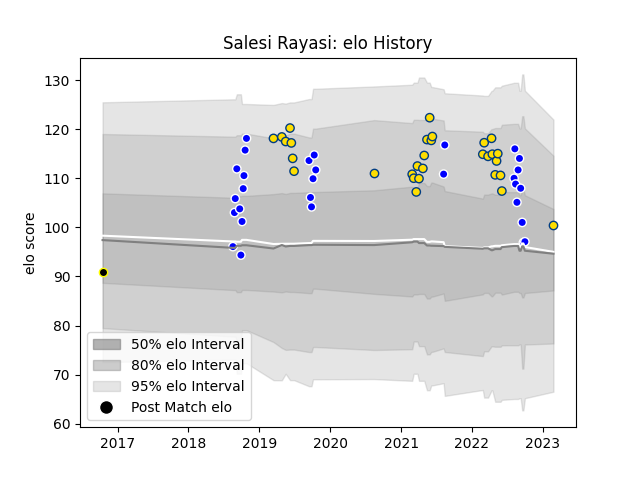

---  
layout: page  
title: Salesi Rayasi  
date: 2023-03-17 17:35:04.856577  
categories: player  
---
# Salesi Rayasi

## Positions: W

## Current elo: 92.0

## Current Percentile: 54.0

# Elo History

# Match History

| Team       |   Appearances |   Win Rate |
|:-----------|--------------:|-----------:|
| Hurricanes |            32 |   0.546875 |
| Auckland   |            29 |   0.689655 |
| Wellington |             1 |   0        |

| Opponent                 |   Matches |   Win Rate |
|:-------------------------|----------:|-----------:|
| Highlanders              |         5 |   0.8      |
| Tasman                   |         5 |   0.4      |
| Blues                    |         5 |   0.4      |
| Chiefs                   |         4 |   0.375    |
| Brumbies                 |         3 |   0        |
| Wellington               |         3 |   0.666667 |
| Canterbury               |         3 |   0.666667 |
| Waikato                  |         3 |   0.333333 |
| Taranaki                 |         3 |   1        |
| Southland                |         3 |   1        |
| Moana Pasifika           |         2 |   0.5      |
| Northland                |         2 |   0.5      |
| North Harbour            |         2 |   1        |
| New South Wales Waratahs |         2 |   1        |
| Western Force            |         2 |   0.5      |
| Queensland Reds          |         2 |   1        |
| Crusaders                |         2 |   0        |
| Counties Manukau         |         2 |   1        |
| Otago                    |         2 |   0.5      |
| Bay of Plenty            |         1 |   0        |
| Manawatu                 |         1 |   1        |
| Lions                    |         1 |   1        |
| Jaguares                 |         1 |   0        |
| Fijian Drua              |         1 |   1        |
| Bulls                    |         1 |   1        |
| Melbourne Rebels         |         1 |   1        |