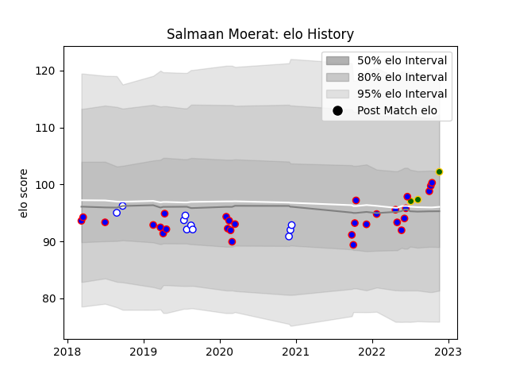

---  
layout: page  
title: Salmaan Moerat  
date: 2022-12-09 13:17:46.141788  
categories: player  
---
# Salmaan Moerat

## Positions: L

## Country: South Africa

## Current elo: 100.0

## Current Percentile: 74.0

# Elo History

# Match History

| Team             |   Appearances |   Win Rate |
|:-----------------|--------------:|-----------:|
| Stormers         |            30 |        0.6 |
| Western Province |            10 |        0.4 |
| South Africa     |             3 |        1   |

| Opponent            |   Matches |   Win Rate |
|:--------------------|----------:|-----------:|
| Bulls               |         4 |   0.75     |
| Edinburgh           |         3 |   0.833333 |
| Jaguares            |         2 |   0.5      |
| Griquas             |         2 |   0.5      |
| Lions               |         2 |   0.5      |
| Blue Bulls          |         2 |   0.5      |
| Hurricanes          |         2 |   0.5      |
| Golden Lions        |         2 |   0        |
| Free State Cheetahs |         2 |   0.5      |
| Dragons             |         2 |   1        |
| Blues               |         2 |   0.5      |
| Ulster              |         1 |   1        |
| New Zealand         |         1 |   1        |
| Sharks              |         1 |   0        |
| Scarlets            |         1 |   1        |
| Wales               |         1 |   1        |
| Queensland Reds     |         1 |   0        |
| Pumas               |         1 |   1        |
| Ospreys             |         1 |   0.5      |
| Benetton Treviso    |         1 |   0        |
| Natal Sharks        |         1 |   0        |
| Munster             |         1 |   0        |
| Melbourne Rebels    |         1 |   1        |
| Leinster            |         1 |   1        |
| Italy               |         1 |   1        |
| Highlanders         |         1 |   0        |
| Glasgow Warriors    |         1 |   1        |
| Brumbies            |         1 |   0        |
| Zebre               |         1 |   1        |