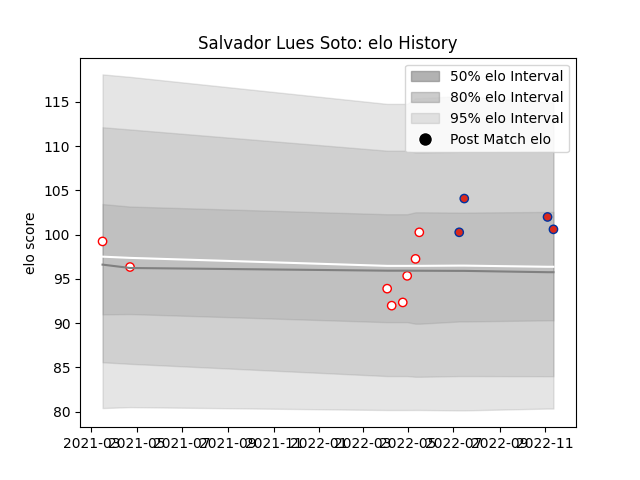

---  
layout: page  
title: Salvador Lues Soto  
date: 2022-11-15 23:36:18.034731  
categories: player  
---
# Salvador Lues Soto

## Positions: P

## Country: Chile

## Current elo: 101.0

## Current Percentile: 73.0

# Elo History

# Match History

| Team    |   Appearances |   Win Rate |
|:--------|--------------:|-----------:|
| Selknam |             8 |       0.75 |
| Chile   |             4 |       0.25 |

| Opponent                 |   Matches |   Win Rate |
|:-------------------------|----------:|-----------:|
| Cafeteros Pro            |         3 |        1   |
| Penarol Rugby            |         2 |        0.5 |
| United States of America |         2 |        0.5 |
| Cobras                   |         1 |        1   |
| Jaguares XV              |         1 |        0   |
| Olimpia Lions            |         1 |        1   |
| Romania                  |         1 |        0   |
| Tonga                    |         1 |        0   |