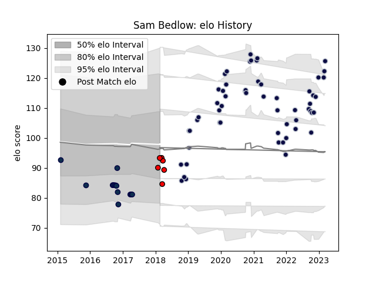

---  
layout: page  
title: Sam Bedlow  
date: 2023-03-21 18:31:06.189281  
categories: player  
---
# Sam Bedlow

Last updated: 2023-03-21
## Positions: C

## Current elo: 93.0

## Current Percentile: 33.0

# Elo History

# Match History

| Team             |   Appearances |   Win Rate |
|:-----------------|--------------:|-----------:|
| Bristol Rugby    |            57 |   0.605263 |
| Sale Sharks      |            13 |   0.384615 |
| Hartpury College |             6 |   0.166667 |

| Opponent               |   Matches |   Win Rate |
|:-----------------------|----------:|-----------:|
| Wasps                  |         6 |   0.333333 |
| Gloucester Rugby       |         6 |   0.5      |
| Harlequins             |         6 |   0.833333 |
| Northampton Saints     |         6 |   0.666667 |
| Sale Sharks            |         5 |   0.4      |
| Exeter Chiefs          |         5 |   0        |
| Bath Rugby             |         4 |   1        |
| Saracens               |         4 |   0.25     |
| Leicester Tigers       |         4 |   0.75     |
| Worcester Warriors     |         3 |   1        |
| London Irish           |         3 |   0.833333 |
| Newcastle Falcons      |         2 |   0        |
| Stade Francais Paris   |         2 |   1        |
| RC Enisei              |         2 |   1        |
| Zebre                  |         2 |   0.5      |
| La Rochelle            |         2 |   0.5      |
| Brive                  |         2 |   1        |
| Bristol Rugby          |         2 |   0.5      |
| Bedford                |         1 |   0        |
| Enisey-STM Krasnoyarsk |         1 |   1        |
| Richmond               |         1 |   0        |
| Dragons                |         1 |   0        |
| Doncaster              |         1 |   0        |
| Scarlets               |         1 |   0        |
| Cornish Pirates        |         1 |   0        |
| Toulon                 |         1 |   0        |
| Yorkshire Carnegie     |         1 |   0        |
| London Scottish        |         1 |   1        |