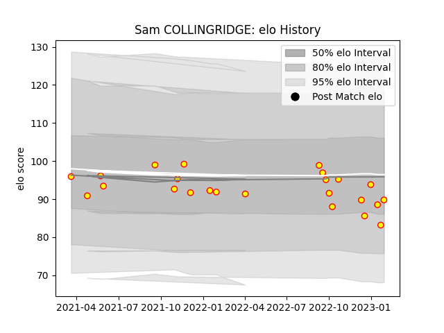

---  
layout: page  
title: Sam COLLINGRIDGE  
date: 2023-01-23 15:32:07.709527  
categories: player  
---
# Sam COLLINGRIDGE

## Positions: L

## Current elo: 85.0

## Current Percentile: 34.0

# Elo History

# Match History

| Team     |   Appearances |   Win Rate |
|:---------|--------------:|-----------:|
| Richmond |            23 |   0.195652 |

| Opponent            |   Matches |   Win Rate |
|:--------------------|----------:|-----------:|
| Doncaster           |         4 |   0        |
| Ampthill            |         3 |   0.166667 |
| Jersey              |         3 |   0.333333 |
| Caldy               |         2 |   0        |
| Cornish Pirates     |         2 |   0        |
| Coventry            |         2 |   0        |
| Ealing Trailfinders |         2 |   0        |
| Hartpury College    |         2 |   0.5      |
| London Scottish     |         2 |   1        |
| Nottingham          |         1 |   0        |