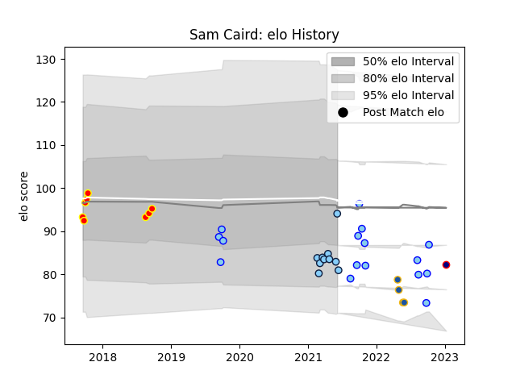

---  
layout: page  
title: Sam Caird  
date: 2023-01-13 11:35:46.298578  
categories: player  
---
# Sam Caird

## Positions: L

## Current elo: 94.0

## Current Percentile: 18.0

# Elo History

# Match History

| Team                     |   Appearances |   Win Rate |
|:-------------------------|--------------:|-----------:|
| Northland                |            16 |     0.1875 |
| New South Wales Waratahs |            10 |     0      |
| Waikato                  |             8 |     0.25   |
| Highlanders              |             4 |     0.25   |
| Hanazono Kintetsu Liners |             1 |     0      |

| Opponent                          |   Matches |   Win Rate |
|:----------------------------------|----------:|-----------:|
| Bay of Plenty                     |         5 |   0.4      |
| Canterbury                        |         3 |   0        |
| Wellington                        |         3 |   0.333333 |
| Tasman                            |         3 |   0        |
| Manawatu                          |         3 |   0        |
| Melbourne Rebels                  |         3 |   0        |
| Brumbies                          |         2 |   0        |
| Waikato                           |         2 |   0.5      |
| Taranaki                          |         2 |   0.5      |
| Queensland Reds                   |         2 |   0        |
| Western Force                     |         2 |   0        |
| North Harbour                     |         1 |   0        |
| Otago                             |         1 |   0        |
| Kubota Spears Funabashi Tokyo-Bay |         1 |   0        |
| Southland                         |         1 |   0        |
| Highlanders                       |         1 |   0        |
| Fijian Drua                       |         1 |   1        |
| Crusaders                         |         1 |   0        |
| Chiefs                            |         1 |   0        |
| New South Wales Waratahs          |         1 |   0        |