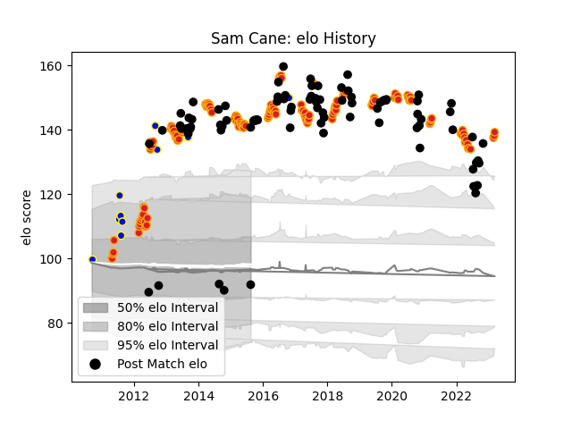

---  
layout: page  
title: Sam Cane  
date: 2023-02-24 09:49:04.948711  
categories: player  
---
# Sam Cane

## Positions: FL

## Country: New Zealand

## Current elo: 92.0

## Current Percentile: 98.0

# Elo History

# Match History

| Team          |   Appearances |   Win Rate |
|:--------------|--------------:|-----------:|
| Chiefs        |           137 |   0.638686 |
| New Zealand   |            89 |   0.825843 |
| Bay of Plenty |            11 |   0.545455 |

| Opponent                 |   Matches |   Win Rate |
|:-------------------------|----------:|-----------:|
| Australia                |        25 |   0.8      |
| Crusaders                |        23 |   0.478261 |
| Blues                    |        17 |   0.735294 |
| Hurricanes               |        16 |   0.4375   |
| Highlanders              |        15 |   0.466667 |
| Argentina                |        14 |   0.857143 |
| South Africa             |        11 |   0.818182 |
| France                   |         8 |   0.875    |
| Ireland                  |         8 |   0.625    |
| Queensland Reds          |         7 |   0.714286 |
| New South Wales Waratahs |         7 |   0.571429 |
| Melbourne Rebels         |         7 |   0.857143 |
| Western Force            |         7 |   0.857143 |
| Brumbies                 |         7 |   0.571429 |
| Bulls                    |         6 |   0.75     |
| Wales                    |         5 |   1        |
| Cheetahs                 |         5 |   0.9      |
| Stormers                 |         5 |   0.8      |
| Sharks                   |         5 |   0.8      |
| Lions                    |         4 |   0.75     |
| Italy                    |         3 |   1        |
| British and Irish Lions  |         3 |   0.5      |
| United States of America |         2 |   1        |
| Sunwolves                |         2 |   1        |
| Southern Kings           |         2 |   1        |
| Scotland                 |         2 |   1        |
| Otago                    |         2 |   0.5      |
| Namibia                  |         2 |   1        |
| Japan                    |         2 |   1        |
| Jaguares                 |         2 |   0.5      |
| Northland                |         1 |   0        |
| Hawke's Bay              |         1 |   0        |
| North Harbour            |         1 |   1        |
| Samoa                    |         1 |   1        |
| Canterbury               |         1 |   1        |
| Manawatu                 |         1 |   1        |
| Auckland                 |         1 |   0        |
| Southland                |         1 |   1        |
| Taranaki                 |         1 |   0        |
| Tonga                    |         1 |   1        |
| Counties Manukau         |         1 |   1        |
| England                  |         1 |   0        |
| Georgia                  |         1 |   1        |