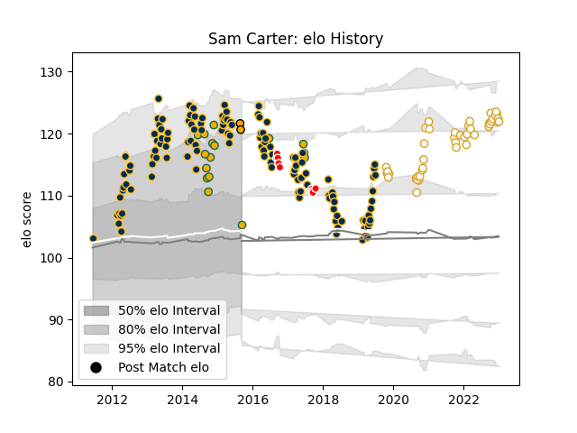

---  
layout: page  
title: Sam Carter  
date: 2022-12-09 13:18:17.909584  
categories: player  
---
# Sam Carter

## Positions: L

## Country: Australia

## Current elo: 111.0

## Current Percentile: 88.0

# Elo History

# Match History

| Team               |   Appearances |   Win Rate |
|:-------------------|--------------:|-----------:|
| Brumbies           |           122 |   0.57377  |
| Ulster             |            38 |   0.736842 |
| Australia          |            15 |   0.433333 |
| Canberra Vikings   |             9 |   0.555556 |
| NSW Country Eagles |             2 |   0.5      |

| Opponent                 |   Matches |   Win Rate |
|:-------------------------|----------:|-----------:|
| Melbourne Rebels         |        15 |   0.533333 |
| New South Wales Waratahs |        14 |   0.714286 |
| Queensland Reds          |        13 |   0.5      |
| Western Force            |        10 |   0.9      |
| Leinster                 |         7 |   0.285714 |
| Lions                    |         7 |   0.714286 |
| Chiefs                   |         7 |   0.428571 |
| Bulls                    |         7 |   0.714286 |
| Blues                    |         7 |   0.428571 |
| Highlanders              |         6 |   0.333333 |
| Crusaders                |         6 |   0        |
| Hurricanes               |         6 |   0.666667 |
| Sharks                   |         5 |   0.6      |
| Cheetahs                 |         5 |   0.8      |
| Stormers                 |         5 |   0.4      |
| Munster                  |         5 |   0.4      |
| Sunwolves                |         5 |   1        |
| Jaguares                 |         4 |   0.25     |
| Zebre                    |         4 |   1        |
| Southern Kings           |         3 |   0.833333 |
| Cardiff Blues            |         3 |   1        |
| Connacht                 |         3 |   0.666667 |
| New Zealand              |         3 |   0.166667 |
| Greater Sydney Rams      |         2 |   1        |
| Dragons                  |         2 |   1        |
| Benetton Treviso         |         2 |   1        |
| Brisbane City            |         2 |   0.5      |
| South Africa             |         2 |   0.5      |
| Scarlets                 |         2 |   1        |
| Glasgow Warriors         |         2 |   1        |
| Perth Spirit             |         2 |   0.5      |
| Argentina                |         2 |   0.5      |
| Edinburgh                |         2 |   1        |
| England                  |         2 |   0        |
| Stade Toulousain         |         1 |   0        |
| Ireland                  |         1 |   0        |
| Wales                    |         1 |   1        |
| Sydney Rays              |         1 |   1        |
| Italy                    |         1 |   1        |
| Canberra Vikings         |         1 |   0        |
| NSW Country Eagles       |         1 |   0        |
| France                   |         1 |   1        |
| Ospreys                  |         1 |   1        |
| Fiji                     |         1 |   1        |
| Scotland                 |         1 |   0        |
| Melbourne Rising         |         1 |   0        |
| Queensland Country       |         1 |   1        |
| Bath Rugby               |         1 |   1        |