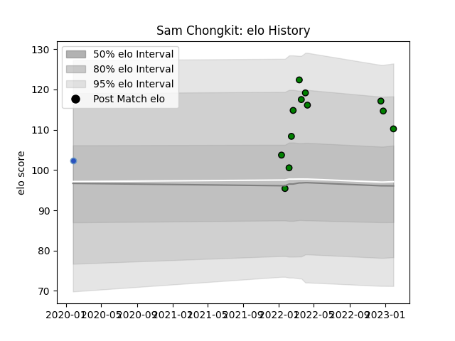

---  
layout: page  
title: Sam Chongkit  
date: 2023-03-21 18:13:48.336177  
categories: player  
---
# Sam Chongkit

Last updated: 2023-03-21
## Positions: FL, N8

## Current elo: 94.0

## Current Percentile: 47.0

# Elo History

# Match History

| Team                 |   Appearances |   Win Rate |
|:---------------------|--------------:|-----------:|
| Mitsubishi Dynaboars |            15 |   0.666667 |
| Munakata Sanix Blues |             3 |   0.333333 |

| Opponent                          |   Matches |   Win Rate |
|:----------------------------------|----------:|-----------:|
| Hanazono Kintetsu Liners          |         2 |        1   |
| Hino Red Dolphins                 |         2 |        1   |
| Mie Honda Heat                    |         2 |        0.5 |
| Skyactivs Hiroshima               |         2 |        1   |
| Toyota Verblitz                   |         2 |        0.5 |
| Black Rams Tokyo                  |         1 |        1   |
| Kamaishi Seawaves                 |         1 |        1   |
| Kobelco Kobe Steelers             |         1 |        0   |
| Kubota Spears Funabashi Tokyo-Bay |         1 |        0   |
| NTT Docomo Red Hurricanes Osaka   |         1 |        1   |
| Saitama Wild Knights              |         1 |        0   |
| Tokyo Sungoliath                  |         1 |        0   |
| Yokohama Canon Eagles             |         1 |        0   |