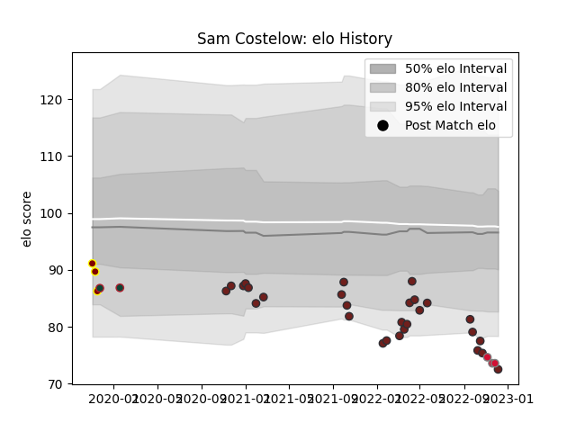

---  
layout: page  
title: Sam Costelow  
date: 2022-12-18 16:28:16.741786  
categories: player  
---
# Sam Costelow

## Positions: FH

## Country: Wales

## Current elo: 77.0

## Current Percentile: 3.0

# Elo History

# Match History

| Team             |   Appearances |   Win Rate |
|:-----------------|--------------:|-----------:|
| Scarlets         |            30 |   0.416667 |
| Ampthill         |             3 |   0.333333 |
| Wales            |             3 |   0        |
| Leicester Tigers |             2 |   0.5      |

| Opponent         |   Matches |   Win Rate |
|:-----------------|----------:|-----------:|
| Cardiff Blues    |         5 |        0.6 |
| Zebre            |         3 |        1   |
| Ulster           |         3 |        0   |
| Ospreys          |         3 |        0.5 |
| Dragons          |         2 |        0.5 |
| Lions            |         2 |        0.5 |
| Leinster         |         2 |        0   |
| Jersey           |         1 |        0   |
| Stormers         |         1 |        0   |
| Sharks           |         1 |        0   |
| Pau              |         1 |        0   |
| New Zealand      |         1 |        0   |
| Munster          |         1 |        0   |
| Australia        |         1 |        0   |
| Hartpury College |         1 |        1   |
| Bayonne          |         1 |        1   |
| Georgia          |         1 |        0   |
| Edinburgh        |         1 |        0   |
| Cornish Pirates  |         1 |        0   |
| Connacht         |         1 |        0   |
| Cheetahs         |         1 |        1   |
| Bulls            |         1 |        0   |
| Bordeaux Begles  |         1 |        0   |
| Benetton Treviso |         1 |        1   |
| Glasgow Warriors |         1 |        1   |