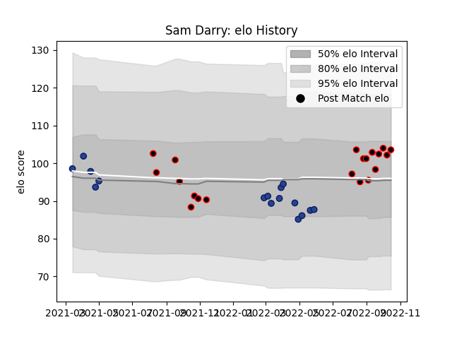

---  
layout: page  
title: Sam Darry  
date: 2023-03-30 11:33:31.589175  
categories: player  
---
# Sam Darry

Last updated: 2023-03-30
## Positions: L

## Current elo: 104.0

## Current Percentile: 67.0

# Elo History

# Match History

| Team       |   Appearances |   Win Rate |
|:-----------|--------------:|-----------:|
| Canterbury |            20 |     0.75   |
| Blues      |            16 |     0.8125 |

| Opponent                 |   Matches |   Win Rate |
|:-------------------------|----------:|-----------:|
| Highlanders              |         4 |       0.75 |
| Auckland                 |         2 |       0.5  |
| Northland                |         2 |       1    |
| Chiefs                   |         2 |       1    |
| Waikato                  |         2 |       0.5  |
| Tasman                   |         2 |       1    |
| Hawke's Bay              |         2 |       0.5  |
| Hurricanes               |         2 |       0.5  |
| Manawatu                 |         2 |       1    |
| Moana Pasifika           |         2 |       1    |
| Otago                    |         2 |       0.5  |
| Wellington               |         1 |       1    |
| Taranaki                 |         1 |       0    |
| Southland                |         1 |       1    |
| Melbourne Rebels         |         1 |       1    |
| North Harbour            |         1 |       1    |
| New South Wales Waratahs |         1 |       1    |
| Bay of Plenty            |         1 |       1    |
| Fijian Drua              |         1 |       1    |
| Crusaders                |         1 |       0    |
| Counties Manukau         |         1 |       1    |
| Brumbies                 |         1 |       1    |
| Western Force            |         1 |       1    |