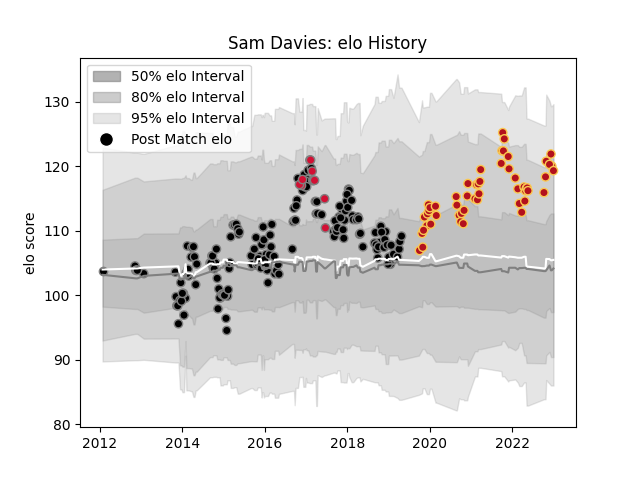

---  
layout: page  
title: Sam Davies  
date: 2023-03-21 18:57:12.505010  
categories: player  
---
# Sam Davies

Last updated: 2023-03-21
## Positions: FH, FB

## Country: Wales

## Current elo: 129.0

## Current Percentile: 95.0

# Elo History

# Match History

| Team    |   Appearances |   Win Rate |
|:--------|--------------:|-----------:|
| Ospreys |           164 |   0.542683 |
| Dragons |            62 |   0.330645 |
| Wales   |            10 |   0.6      |

| Opponent               |   Matches |   Win Rate |
|:-----------------------|----------:|-----------:|
| Cardiff Blues          |        18 |  0.722222  |
| Zebre                  |        16 |  0.75      |
| Benetton Treviso       |        15 |  0.633333  |
| Scarlets               |        15 |  0.533333  |
| Munster                |        15 |  0.2       |
| Glasgow Warriors       |        15 |  0.3       |
| Leinster               |        14 |  0.178571  |
| Connacht               |        13 |  0.615385  |
| Dragons                |        13 |  0.769231  |
| Edinburgh              |        13 |  0.461538  |
| Ulster                 |        12 |  0.0833333 |
| Northampton Saints     |         6 |  0.333333  |
| Ospreys                |         6 |  0.583333  |
| Cheetahs               |         5 |  0.8       |
| Clermont Auvergne      |         4 |  0.25      |
| Castres Olympique      |         3 |  0.666667  |
| Saracens               |         3 |  0.166667  |
| Lions                  |         3 |  0.166667  |
| Pau                    |         3 |  0.333333  |
| Lyon                   |         3 |  0.666667  |
| Gloucester Rugby       |         3 |  0.333333  |
| Exeter Chiefs          |         3 |  0.333333  |
| Worcester Warriors     |         3 |  0.333333  |
| Bordeaux Begles        |         2 |  0.5       |
| Racing 92              |         2 |  0.25      |
| Stade Francais Paris   |         2 |  0.5       |
| Southern Kings         |         2 |  1         |
| Newcastle Falcons      |         2 |  1         |
| Grenoble               |         2 |  1         |
| Scotland               |         1 |  0         |
| England                |         1 |  0         |
| Wasps                  |         1 |  0         |
| Enisey-STM Krasnoyarsk |         1 |  1         |
| Tonga                  |         1 |  1         |
| Stormers               |         1 |  0         |
| France                 |         1 |  0         |
| Bulls                  |         1 |  0         |
| South Africa           |         1 |  1         |
| Bristol Rugby          |         1 |  0         |
| Bath Rugby             |         1 |  1         |
| Ireland                |         1 |  1         |
| Samoa                  |         1 |  1         |
| Sale Sharks            |         1 |  1         |
| Italy                  |         1 |  1         |
| RC Enisei              |         1 |  1         |
| Perpignan              |         1 |  0         |
| Japan                  |         1 |  1         |
| Leicester Tigers       |         1 |  0         |
| Australia              |         1 |  0         |