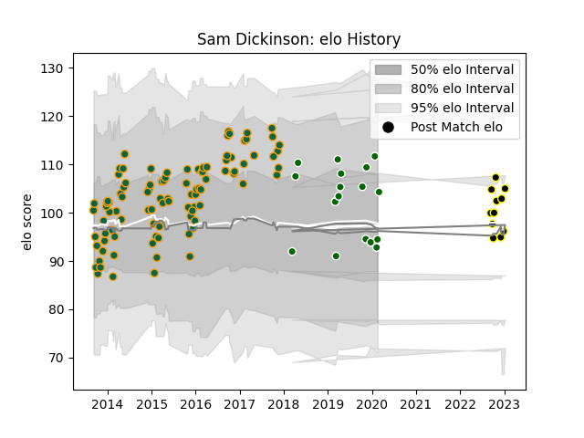

---  
layout: page  
title: Sam Dickinson  
date: 2022-12-18 16:22:25.922155  
categories: player  
---
# Sam Dickinson

## Positions: N8, L

## Current elo: 109.0

## Current Percentile: 79.0

# Elo History

# Match History

| Team                |   Appearances |   Win Rate |
|:--------------------|--------------:|-----------:|
| Northampton Saints  |            97 |   0.659794 |
| Ealing Trailfinders |            11 |   0.727273 |
| Caldy               |             9 |   0.222222 |

| Opponent            |   Matches |   Win Rate |
|:--------------------|----------:|-----------:|
| Saracens            |        10 |   0.5      |
| Harlequins          |         9 |   0.888889 |
| Worcester Warriors  |         7 |   0.714286 |
| Bath Rugby          |         7 |   0.642857 |
| Wasps               |         7 |   0.571429 |
| Exeter Chiefs       |         7 |   0.571429 |
| Sale Sharks         |         6 |   0.5      |
| London Irish        |         6 |   0.833333 |
| Leicester Tigers    |         6 |   0.416667 |
| Gloucester Rugby    |         6 |   0.583333 |
| Newcastle Falcons   |         5 |   0.8      |
| Scarlets            |         3 |   1        |
| Racing 92           |         3 |   0.166667 |
| Cornish Pirates     |         3 |   0.333333 |
| Coventry            |         3 |   0.666667 |
| Ospreys             |         2 |   1        |
| London Welsh        |         2 |   1        |
| Nottingham          |         2 |   0.5      |
| London Scottish     |         2 |   0.5      |
| Jersey              |         2 |   0.5      |
| Leinster            |         2 |   0.5      |
| Hartpury College    |         2 |   0.5      |
| Doncaster           |         2 |   0.5      |
| Castres Olympique   |         2 |   0.5      |
| Benetton Treviso    |         2 |   1        |
| Bedford             |         2 |   0.5      |
| Montpellier Herault |         1 |   1        |
| Glasgow Warriors    |         1 |   1        |
| Dragons             |         1 |   1        |
| Clermont Auvergne   |         1 |   0        |
| Richmond            |         1 |   1        |
| Bristol Rugby       |         1 |   1        |
| Ampthill            |         1 |   0        |