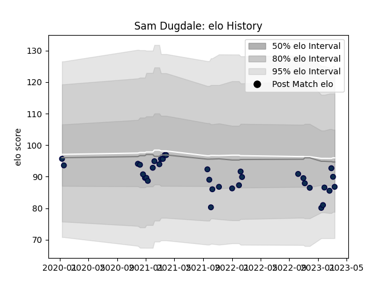

---  
layout: page  
title: Sam Dugdale  
date: 2023-01-15 11:53:00.637885  
categories: player  
---
# Sam Dugdale

## Positions: FL

## Current elo: 90.0

## Current Percentile: 54.0

# Elo History

# Match History

| Team        |   Appearances |   Win Rate |
|:------------|--------------:|-----------:|
| Sale Sharks |            28 |   0.660714 |

| Opponent           |   Matches |   Win Rate |
|:-------------------|----------:|-----------:|
| Gloucester Rugby   |         3 |   0.666667 |
| Leicester Tigers   |         3 |   1        |
| London Irish       |         3 |   0.833333 |
| Wasps              |         3 |   0.666667 |
| Bristol Rugby      |         2 |   1        |
| Exeter Chiefs      |         2 |   0.5      |
| Newcastle Falcons  |         2 |   0.5      |
| Northampton Saints |         2 |   0.5      |
| Worcester Warriors |         2 |   1        |
| Bath Rugby         |         1 |   1        |
| Glasgow Warriors   |         1 |   0        |
| Harlequins         |         1 |   1        |
| La Rochelle        |         1 |   0        |
| Saracens           |         1 |   0        |
| Stade Toulousain   |         1 |   0        |