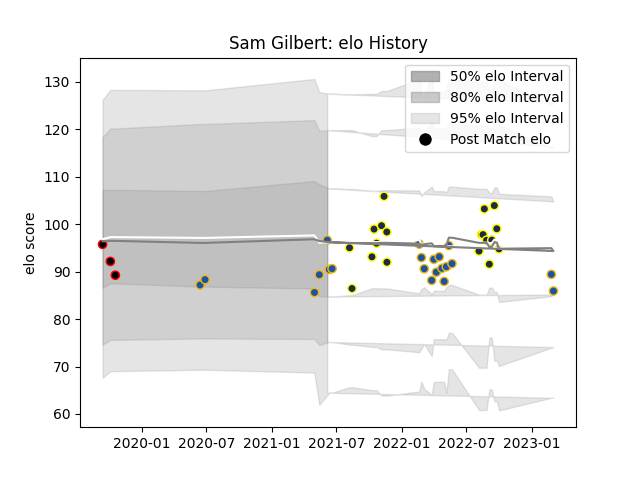

---  
layout: page  
title: Sam Gilbert  
date: 2023-03-17 17:11:04.695882  
categories: player  
---
# Sam Gilbert

## Positions: FB, W

## Current elo: 97.0

## Current Percentile: 33.0

# Elo History

# Match History

| Team        |   Appearances |   Win Rate |
|:------------|--------------:|-----------:|
| Highlanders |            21 |   0.380952 |
| Otago       |            19 |   0.473684 |
| Canterbury  |             3 |   0.666667 |

| Opponent                 |   Matches |   Win Rate |
|:-------------------------|----------:|-----------:|
| Blues                    |         4 |        0   |
| Crusaders                |         3 |        0   |
| Hurricanes               |         3 |        0   |
| Taranaki                 |         3 |        0   |
| Manawatu                 |         2 |        1   |
| Queensland Reds          |         2 |        1   |
| Brumbies                 |         2 |        0.5 |
| Canterbury               |         2 |        0.5 |
| Chiefs                   |         2 |        0.5 |
| Wellington               |         2 |        0   |
| Waikato                  |         2 |        0.5 |
| Hawke's Bay              |         2 |        0.5 |
| New South Wales Waratahs |         2 |        0.5 |
| Northland                |         2 |        1   |
| Southland                |         2 |        1   |
| Tasman                   |         1 |        1   |
| Auckland                 |         1 |        0   |
| Otago                    |         1 |        1   |
| Moana Pasifika           |         1 |        1   |
| Bay of Plenty            |         1 |        0   |
| Fijian Drua              |         1 |        1   |
| Counties Manukau         |         1 |        0   |
| Western Force            |         1 |        1   |