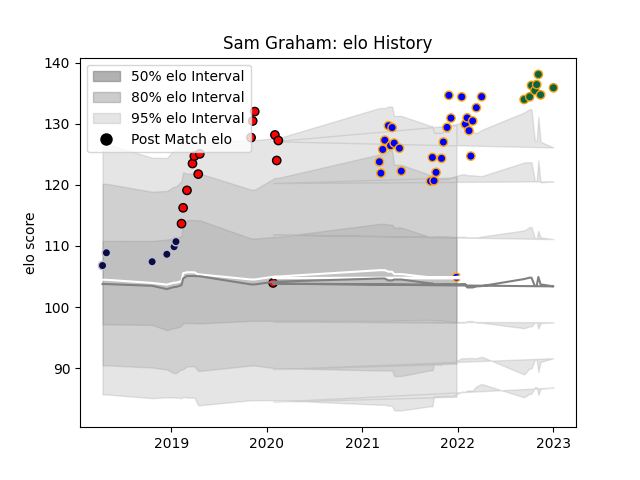

---  
layout: page  
title: Sam Graham  
date: 2022-11-15 23:37:35.734675  
categories: player  
---
# Sam Graham

## Positions: FL, N8

## Current elo: 121.0

## Current Percentile: 94.0

# Elo History

# Match History

| Team               |   Appearances |   Win Rate |
|:-------------------|--------------:|-----------:|
| Doncaster          |            27 |   0.814815 |
| Hartpury College   |            13 |   0.461538 |
| Northampton Saints |             7 |   0.428571 |
| Bristol Rugby      |             6 |   0.833333 |

| Opponent            |   Matches |   Win Rate |
|:--------------------|----------:|-----------:|
| Ealing Trailfinders |         5 |   0.4      |
| Ampthill            |         4 |   0.75     |
| Bedford             |         4 |   0.75     |
| Hartpury College    |         4 |   1        |
| Jersey              |         4 |   1        |
| Richmond            |         4 |   1        |
| Nottingham          |         3 |   0.666667 |
| Cornish Pirates     |         3 |   0.666667 |
| Coventry            |         3 |   0.333333 |
| London Scottish     |         3 |   1        |
| Saracens            |         2 |   0        |
| RC Enisei           |         2 |   1        |
| Yorkshire Carnegie  |         1 |   1        |
| Wasps               |         1 |   1        |
| Sale Sharks         |         1 |   0        |
| La Rochelle         |         1 |   1        |
| Newcastle Falcons   |         1 |   0        |
| London Irish        |         1 |   0        |
| Bath Rugby          |         1 |   0        |
| Harlequins          |         1 |   0        |
| Exeter Chiefs       |         1 |   1        |
| Doncaster           |         1 |   1        |
| Bristol Rugby       |         1 |   1        |
| Zebre               |         1 |   0        |