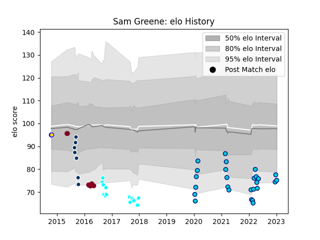

---  
layout: page  
title: Sam Greene  
date: 2023-03-17 17:00:52.186848  
categories: player  
---
# Sam Greene

## Positions: FH, FB

## Current elo: 73.0

## Current Percentile: 8.0

# Elo History

# Match History

| Team                             |   Appearances |   Win Rate |
|:---------------------------------|--------------:|-----------:|
| Toyota Industries Shuttles Aichi |            29 |   0.206897 |
| Shizuoka Blue Revs               |            24 |   0.458333 |
| Queensland Reds                  |            10 |   0.25     |
| Queensland Country               |             7 |   0.142857 |
| Brisbane City                    |             2 |   1        |

| Opponent                          |   Matches |   Win Rate |
|:----------------------------------|----------:|-----------:|
| Toyota Verblitz                   |         6 |   0.166667 |
| Green Rockets Tokatsu             |         5 |   0.6      |
| Black Rams Tokyo                  |         4 |   0.5      |
| Urayasu D-Rocks                   |         4 |   0.25     |
| Toshiba Brave Lupus Tokyo         |         4 |   0.25     |
| Munakata Sanix Blues              |         4 |   0.5      |
| Yokohama Canon Eagles             |         4 |   0        |
| Saitama Wild Knights              |         3 |   0        |
| Hino Red Dolphins                 |         3 |   1        |
| Kobelco Kobe Steelers             |         3 |   0        |
| Kubota Spears Funabashi Tokyo-Bay |         3 |   0        |
| Tokyo Sungoliath                  |         3 |   0        |
| NTT Docomo Red Hurricanes Osaka   |         3 |   0.666667 |
| New South Wales Waratahs          |         2 |   0        |
| Melbourne Rebels                  |         2 |   0.5      |
| Canberra Vikings                  |         2 |   0.5      |
| Western Force                     |         1 |   0        |
| Brisbane City                     |         1 |   0        |
| Bulls                             |         1 |   0        |
| Sydney Stars                      |         1 |   0        |
| Shizuoka Blue Revs                |         1 |   0        |
| Sharks                            |         1 |   0        |
| Greater Sydney Rams               |         1 |   1        |
| Perth Spirit                      |         1 |   0        |
| North Harbour Rays                |         1 |   0        |
| Crusaders                         |         1 |   0        |
| NSW Country Eagles                |         1 |   1        |
| Coca-Cola Red Sparks              |         1 |   1        |
| Blues                             |         1 |   0.5      |
| Melbourne Rising                  |         1 |   0        |
| Highlanders                       |         1 |   1        |
| Hanazono Kintetsu Liners          |         1 |   0        |
| Mitsubishi Dynaboars              |         1 |   1        |