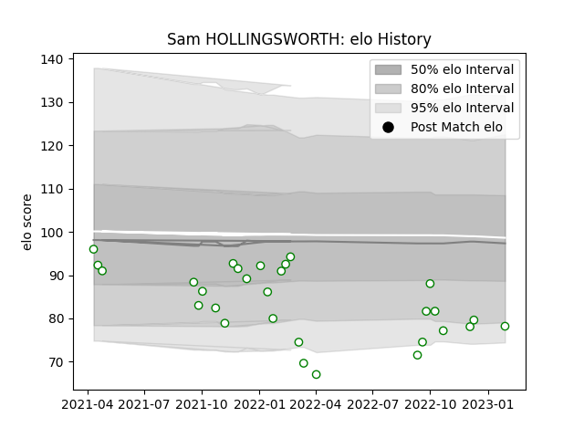

---  
layout: page  
title: Sam HOLLINGSWORTH  
date: 2023-03-06 11:28:47.571497  
categories: player  
---
# Sam HOLLINGSWORTH

## Positions: FH

## Current elo: 72.0

## Current Percentile: 13.0

# Elo History

# Match History

| Team       |   Appearances |   Win Rate |
|:-----------|--------------:|-----------:|
| Nottingham |            31 |   0.290323 |

| Opponent            |   Matches |   Win Rate |
|:--------------------|----------:|-----------:|
| Hartpury College    |         5 |   0.2      |
| Cornish Pirates     |         4 |   0        |
| Doncaster           |         4 |   0.25     |
| Jersey              |         4 |   0        |
| London Scottish     |         3 |   1        |
| Richmond            |         3 |   0.333333 |
| Ampthill            |         2 |   0.5      |
| Bedford             |         2 |   0        |
| Coventry            |         2 |   0.5      |
| Caldy               |         1 |   1        |
| Ealing Trailfinders |         1 |   0        |