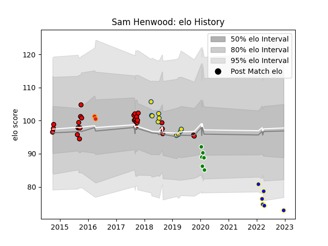

---  
layout: page  
title: Sam Henwood  
date: 2023-03-21 17:58:15.781421  
categories: player  
---
# Sam Henwood

Last updated: 2023-03-21
## Positions: FL, N8

## Country: New Zealand Maori

## Current elo: 105.0

## Current Percentile: 64.0

# Elo History

# Match History

| Team                  |   Appearances |   Win Rate |
|:----------------------|--------------:|-----------:|
| Counties Manukau      |            27 |   0.462963 |
| Kamaishi Seawaves     |            11 |   0.272727 |
| Hurricanes            |            10 |   0.7      |
| Green Rockets Tokatsu |             6 |   0        |
| Chiefs                |             2 |   1        |
| Auckland              |             1 |   0        |
| New Zealand Maori     |             1 |   1        |

| Opponent                 |   Matches |   Win Rate |
|:-------------------------|----------:|-----------:|
| Auckland                 |         4 |   0.5      |
| Hino Red Dolphins        |         4 |   0        |
| Tasman                   |         4 |   0.75     |
| Bay of Plenty            |         3 |   0.166667 |
| Taranaki                 |         3 |   0        |
| Chiefs                   |         3 |   0.666667 |
| Manawatu                 |         3 |   0.666667 |
| Northland                |         2 |   1        |
| North Harbour            |         2 |   0        |
| Kurita Water Gush        |         2 |   1        |
| Hawke's Bay              |         2 |   0.5      |
| Skyactivs Hiroshima      |         2 |   0.5      |
| Hanazono Kintetsu Liners |         2 |   0        |
| Canterbury               |         2 |   0        |
| Waikato                  |         2 |   0.5      |
| Blues                    |         2 |   1        |
| Tokyo Sungoliath         |         1 |   0        |
| Wellington               |         1 |   1        |
| Sunwolves                |         1 |   1        |
| Western Force            |         1 |   1        |
| Stormers                 |         1 |   1        |
| Mitsubishi Dynaboars     |         1 |   0        |
| Shimizu Blue Sharks      |         1 |   0        |
| Sharks                   |         1 |   1        |
| Munakata Sanix Blues     |         1 |   0        |
| Mie Honda Heat           |         1 |   0        |
| Melbourne Rebels         |         1 |   1        |
| Crusaders                |         1 |   0        |
| Canada                   |         1 |   1        |
| Brumbies                 |         1 |   0        |
| Black Rams Tokyo         |         1 |   0        |
| Yokohama Canon Eagles    |         1 |   0        |