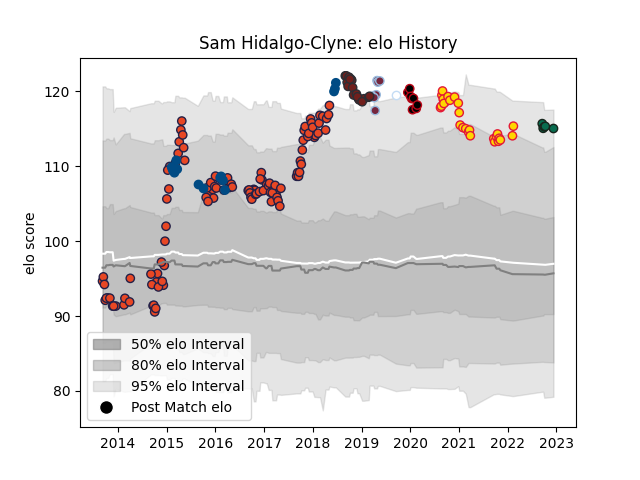

---  
layout: page  
title: Sam Hidalgo-Clyne  
date: 2023-01-13 11:37:27.048827  
categories: player  
---
# Sam Hidalgo-Clyne

## Positions: SH

## Country: Scotland

## Current elo: 97.0

## Current Percentile: 91.0

# Elo History

# Match History

| Team             |   Appearances |   Win Rate |
|:-----------------|--------------:|-----------:|
| Edinburgh        |           113 |   0.50885  |
| Exeter Chiefs    |            29 |   0.689655 |
| Scarlets         |            18 |   0.5      |
| Scotland         |            15 |   0.333333 |
| Harlequins       |             8 |   0.25     |
| Lyon             |             8 |   0.5      |
| Benetton Treviso |             6 |   0.666667 |
| Racing 92        |             6 |   0.416667 |

| Opponent                 |   Matches |   Win Rate |
|:-------------------------|----------:|-----------:|
| Dragons                  |        13 |   0.846154 |
| Glasgow Warriors         |        11 |   0.636364 |
| Ulster                   |        11 |   0.363636 |
| Munster                  |        10 |   0.4      |
| Leinster                 |        10 |   0.2      |
| Benetton Treviso         |         9 |   0.555556 |
| Scarlets                 |         9 |   0.5      |
| Connacht                 |         9 |   0.222222 |
| Zebre                    |         7 |   0.571429 |
| Ospreys                  |         7 |   0.285714 |
| Gloucester Rugby         |         7 |   0.714286 |
| Cardiff Blues            |         6 |   0.333333 |
| Northampton Saints       |         6 |   0.333333 |
| London Irish             |         6 |   0.666667 |
| Wasps                    |         5 |   0.4      |
| Stade Francais Paris     |         5 |   0.4      |
| Leicester Tigers         |         5 |   0.6      |
| Racing 92                |         4 |   0.5      |
| Worcester Warriors       |         4 |   1        |
| Harlequins               |         3 |   1        |
| Italy                    |         3 |   0.666667 |
| Bordeaux Begles          |         3 |   0.666667 |
| Southern Kings           |         3 |   1        |
| France                   |         2 |   0.5      |
| Bath Rugby               |         2 |   1        |
| Wales                    |         2 |   0        |
| Bayonne                  |         2 |   0.5      |
| Toulon                   |         2 |   0.5      |
| Timisoara Saracens       |         2 |   1        |
| Stade Toulousain         |         2 |   0.5      |
| Bristol Rugby            |         2 |   0.5      |
| Sale Sharks              |         2 |   0.5      |
| Agen                     |         2 |   0.75     |
| England                  |         2 |   0        |
| Grenoble                 |         2 |   0.5      |
| Ireland                  |         2 |   0        |
| Cheetahs                 |         2 |   0.5      |
| Lyon                     |         2 |   0.5      |
| Krasny Yar               |         2 |   1        |
| London Welsh             |         2 |   1        |
| Castres Olympique        |         1 |   1        |
| Argentina                |         1 |   1        |
| United States of America |         1 |   0        |
| La Rochelle              |         1 |   0        |
| Clermont Auvergne        |         1 |   0        |
| Edinburgh                |         1 |   0        |
| Canada                   |         1 |   1        |
| South Africa             |         1 |   0        |
| Saracens                 |         1 |   0        |
| Newcastle Falcons        |         1 |   0        |
| Perpignan                |         1 |   0        |
| Exeter Chiefs            |         1 |   0        |
| Pau                      |         1 |   1        |