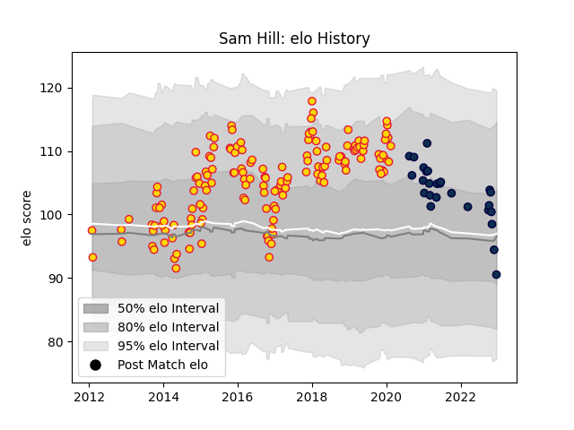

---  
layout: page  
title: Sam Hill  
date: 2022-12-18 16:31:46.312372  
categories: player  
---
# Sam Hill

## Positions: C

## Current elo: 91.0

## Current Percentile: 44.0

# Elo History

# Match History

| Team          |   Appearances |   Win Rate |
|:--------------|--------------:|-----------:|
| Exeter Chiefs |           153 |   0.666667 |
| Sale Sharks   |            26 |   0.615385 |

| Opponent            |   Matches |   Win Rate |
|:--------------------|----------:|-----------:|
| Harlequins          |        16 |   0.6875   |
| Bath Rugby          |        15 |   0.533333 |
| Gloucester Rugby    |        15 |   0.7      |
| Saracens            |        14 |   0.535714 |
| Leicester Tigers    |        14 |   0.642857 |
| Wasps               |        13 |   0.538462 |
| Northampton Saints  |        13 |   0.769231 |
| Newcastle Falcons   |        13 |   0.846154 |
| Sale Sharks         |        12 |   0.666667 |
| Worcester Warriors  |         9 |   0.888889 |
| London Irish        |         8 |   0.875    |
| Exeter Chiefs       |         5 |   0.4      |
| Bristol Rugby       |         5 |   0.8      |
| Glasgow Warriors    |         4 |   0.375    |
| London Welsh        |         3 |   1        |
| Bordeaux Begles     |         3 |   0.666667 |
| Leinster            |         2 |   0        |
| Connacht            |         2 |   1        |
| Ospreys             |         2 |   0.5      |
| Bayonne             |         1 |   1        |
| Montpellier Herault |         1 |   1        |
| Munster             |         1 |   0.5      |
| Clermont Auvergne   |         1 |   0        |
| Cardiff Blues       |         1 |   1        |
| La Rochelle         |         1 |   1        |
| Scarlets            |         1 |   1        |
| Stade Toulousain    |         1 |   0        |
| Toulon              |         1 |   0        |
| Ulster              |         1 |   0        |
| Castres Olympique   |         1 |   0        |