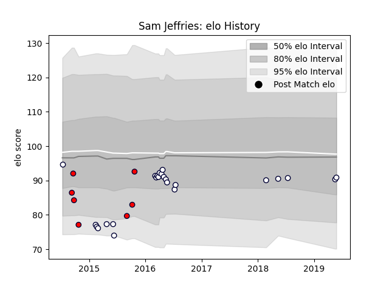

---  
layout: page  
title: Sam Jeffries  
date: 2023-03-02 11:21:11.583280  
categories: player  
---
# Sam Jeffries

## Positions: L

## Current elo: 91.0

## Current Percentile: None

# Elo History

# Match History

| Team             |   Appearances |   Win Rate |
|:-----------------|--------------:|-----------:|
| Melbourne Rebels |            24 |   0.416667 |
| Melbourne Rising |             7 |   0.714286 |

| Opponent                 |   Matches |   Win Rate |
|:-------------------------|----------:|-----------:|
| Bulls                    |         4 |   0.25     |
| Brumbies                 |         3 |   0.333333 |
| New South Wales Waratahs |         3 |   0.333333 |
| Queensland Reds          |         3 |   1        |
| Canberra Vikings         |         2 |   0.5      |
| Crusaders                |         2 |   0.5      |
| Highlanders              |         2 |   0        |
| NSW Country Eagles       |         2 |   1        |
| Perth Spirit             |         2 |   0.5      |
| Sunwolves                |         2 |   1        |
| Blues                    |         1 |   0        |
| Cheetahs                 |         1 |   1        |
| Chiefs                   |         1 |   0        |
| Hurricanes               |         1 |   0        |
| North Harbour Rays       |         1 |   1        |
| Western Force            |         1 |   0        |