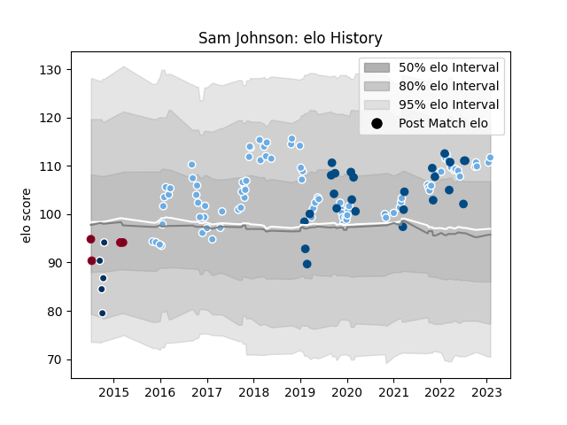

---  
layout: page  
title: Sam Johnson  
date: 2023-02-02 19:14:42.293864  
categories: player  
---
# Sam Johnson

## Positions: C

## Country: Scotland

## Current elo: 112.0

## Current Percentile: 80.0

# Elo History

# Match History

| Team               |   Appearances |   Win Rate |
|:-------------------|--------------:|-----------:|
| Glasgow Warriors   |            87 |   0.528736 |
| Scotland           |            25 |   0.58     |
| Queensland Country |             5 |   0.2      |
| Queensland Reds    |             5 |   0.2      |

| Opponent                 |   Matches |   Win Rate |
|:-------------------------|----------:|-----------:|
| Leinster                 |        12 |   0.333333 |
| Benetton Treviso         |         7 |   0.714286 |
| Ospreys                  |         7 |   0.5      |
| Edinburgh                |         7 |   0.285714 |
| Zebre                    |         5 |   1        |
| Ulster                   |         5 |   0.4      |
| Scarlets                 |         5 |   0        |
| Cardiff Blues            |         5 |   0.8      |
| Munster                  |         5 |   0.4      |
| Ireland                  |         5 |   0        |
| Racing 92                |         4 |   0.75     |
| Italy                    |         4 |   1        |
| France                   |         3 |   0.666667 |
| Argentina                |         3 |   0.333333 |
| Connacht                 |         3 |   1        |
| Exeter Chiefs            |         3 |   0.166667 |
| England                  |         3 |   0.5      |
| Georgia                  |         2 |   1        |
| Western Force            |         2 |   0.5      |
| Sharks                   |         2 |   0.5      |
| Saracens                 |         2 |   0        |
| Sale Sharks              |         2 |   1        |
| Bulls                    |         2 |   0.5      |
| Cheetahs                 |         2 |   1        |
| Japan                    |         2 |   0.5      |
| Montpellier Herault      |         1 |   0        |
| Leicester Tigers         |         1 |   1        |
| Brisbane City            |         1 |   0        |
| Tonga                    |         1 |   1        |
| Sydney Stars             |         1 |   1        |
| Stormers                 |         1 |   0        |
| Southern Kings           |         1 |   1        |
| La Rochelle              |         1 |   1        |
| Brumbies                 |         1 |   0        |
| Samoa                    |         1 |   1        |
| Melbourne Rising         |         1 |   0        |
| Dragons                  |         1 |   1        |
| Australia                |         1 |   1        |
| Perth Spirit             |         1 |   0        |
| Perpignan                |         1 |   1        |
| Highlanders              |         1 |   0        |
| Northampton Saints       |         1 |   0        |
| North Harbour Rays       |         1 |   0        |
| New South Wales Waratahs |         1 |   0        |
| Lions                    |         1 |   1        |