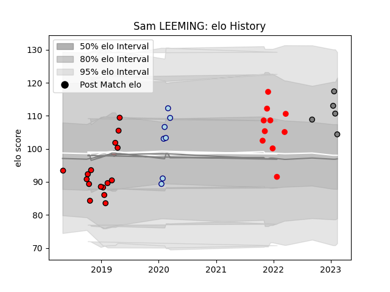

---  
layout: page  
title: Sam LEEMING  
date: 2023-02-16 11:17:34.658917  
categories: player  
---
# Sam LEEMING

## Positions: FH

## Current elo: 104.0

## Current Percentile: 78.0

# Elo History

# Match History

| Team             |   Appearances |   Win Rate |
|:-----------------|--------------:|-----------:|
| Hartpury College |            17 |   0.235294 |
| Jersey           |            10 |   0.75     |
| Bedford          |             7 |   0.571429 |
| Rennes           |             5 |   0        |

| Opponent                   |   Matches |   Win Rate |
|:---------------------------|----------:|-----------:|
| Coventry                   |         4 |   0.75     |
| Bedford                    |         3 |   0.333333 |
| Cornish Pirates            |         3 |   0.333333 |
| Ealing Trailfinders        |         3 |   0        |
| Jersey                     |         3 |   0.666667 |
| Nottingham                 |         3 |   0.666667 |
| London Irish               |         2 |   0        |
| Doncaster                  |         2 |   0.5      |
| Hartpury College           |         2 |   1        |
| Ampthill                   |         2 |   0.75     |
| London Scottish            |         2 |   0.5      |
| Richmond                   |         2 |   0.5      |
| Tarbes                     |         1 |   0        |
| Valence Romans Drome Rugby |         1 |   0        |
| US Bressane                |         1 |   0        |
| Albi                       |         1 |   0        |
| Suresnes                   |         1 |   0        |
| Newcastle Falcons          |         1 |   0        |
| Bristol Rugby              |         1 |   0        |
| Yorkshire Carnegie         |         1 |   0        |