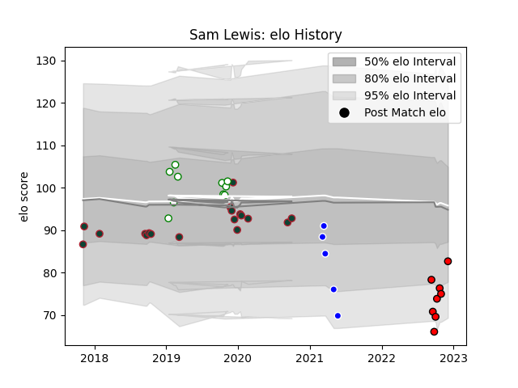

---  
layout: page  
title: Sam Lewis  
date: 2023-03-04 11:35:53.887253  
categories: player  
---
# Sam Lewis

## Positions: FL, L

## Current elo: 83.0

## Current Percentile: None

# Elo History

# Match History

| Team             |   Appearances |   Win Rate |
|:-----------------|--------------:|-----------:|
| Leicester Tigers |            18 |   0.416667 |
| Nottingham       |            10 |   0.4      |
| Hartpury College |             8 |   0.375    |
| Coventry         |             5 |   0.2      |

| Opponent            |   Matches |   Win Rate |
|:--------------------|----------:|-----------:|
| Jersey              |         3 |   0        |
| Doncaster           |         3 |   0.333333 |
| Cardiff Blues       |         3 |   1        |
| Cornish Pirates     |         3 |   0.333333 |
| Wasps               |         2 |   0        |
| Sale Sharks         |         2 |   0        |
| Northampton Saints  |         2 |   0.5      |
| Ealing Trailfinders |         2 |   0        |
| Ampthill            |         2 |   1        |
| Calvisano           |         2 |   1        |
| Bedford             |         2 |   0.5      |
| Pau                 |         1 |   0        |
| Worcester Warriors  |         1 |   0        |
| Ulster              |         1 |   0        |
| Saracens            |         1 |   0        |
| Bristol Rugby       |         1 |   0        |
| Richmond            |         1 |   0        |
| Nottingham          |         1 |   1        |
| Gloucester Rugby    |         1 |   1        |
| Caldy               |         1 |   1        |
| London Scottish     |         1 |   1        |
| London Irish        |         1 |   0        |
| Bath Rugby          |         1 |   0        |
| Hartpury College    |         1 |   0        |
| Harlequins          |         1 |   0.5      |
| Yorkshire Carnegie  |         1 |   0        |