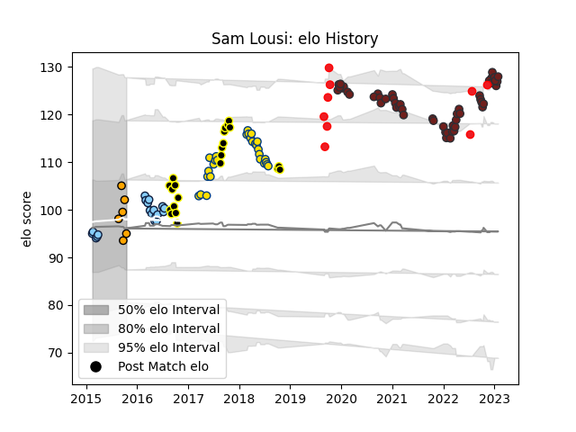

---  
layout: page  
title: Sam Lousi  
date: 2022-11-16 11:20:53.254941  
categories: player  
---
# Sam Lousi

## Positions: L

## Country: Tonga

## Current elo: 101.0

## Current Percentile: 60.0

# Elo History

# Match History

| Team                     |   Appearances |   Win Rate |
|:-------------------------|--------------:|-----------:|
| Scarlets                 |            41 |   0.45122  |
| Hurricanes               |            28 |   0.660714 |
| Wellington               |            22 |   0.681818 |
| New South Wales Waratahs |            19 |   0.526316 |
| Tonga                    |             9 |   0.333333 |
| NSW Country Eagles       |             1 |   0        |

| Opponent                 |   Matches |   Win Rate |
|:-------------------------|----------:|-----------:|
| Crusaders                |         6 |   0.333333 |
| Cardiff Blues            |         6 |   0.5      |
| Highlanders              |         5 |   0.4      |
| Brumbies                 |         5 |   0.4      |
| Chiefs                   |         4 |   0.5      |
| Queensland Reds          |         4 |   1        |
| Bulls                    |         4 |   0.5      |
| Ospreys                  |         4 |   0.625    |
| Blues                    |         4 |   0.75     |
| Melbourne Rebels         |         3 |   0.666667 |
| Munster                  |         3 |   0        |
| Benetton Treviso         |         3 |   0.666667 |
| Northland                |         3 |   1        |
| Connacht                 |         3 |   0.666667 |
| Bay of Plenty            |         3 |   1        |
| Dragons                  |         3 |   0.666667 |
| North Harbour            |         2 |   0.5      |
| Glasgow Warriors         |         2 |   0.5      |
| Lions                    |         2 |   0.5      |
| Leinster                 |         2 |   0        |
| Auckland                 |         2 |   0        |
| Sharks                   |         2 |   0.5      |
| Manawatu                 |         2 |   0.5      |
| Zebre                    |         2 |   1        |
| Sunwolves                |         2 |   1        |
| Taranaki                 |         2 |   1        |
| Toulon                   |         2 |   0        |
| Cheetahs                 |         2 |   1        |
| Ulster                   |         2 |   0        |
| Waikato                  |         2 |   0.5      |
| Western Force            |         2 |   0.5      |
| Bayonne                  |         2 |   1        |
| Edinburgh                |         2 |   0.5      |
| Stormers                 |         1 |   1        |
| Southland                |         1 |   1        |
| Otago                    |         1 |   0        |
| Samoa                    |         1 |   0        |
| Tasman                   |         1 |   0        |
| United States of America |         1 |   1        |
| Queensland Country       |         1 |   0        |
| Argentina                |         1 |   0        |
| New Zealand              |         1 |   0        |
| London Irish             |         1 |   1        |
| Jaguares                 |         1 |   1        |
| Hong Kong                |         1 |   1        |
| Hawke's Bay              |         1 |   1        |
| France                   |         1 |   0        |
| Fiji                     |         1 |   0        |
| England                  |         1 |   0        |
| Counties Manukau         |         1 |   1        |
| Chile                    |         1 |   1        |
| Canterbury               |         1 |   1        |
| British and Irish Lions  |         1 |   0.5      |
| Bristol Rugby            |         1 |   0        |
| Bordeaux Begles          |         1 |   0        |
| Hurricanes               |         1 |   0        |