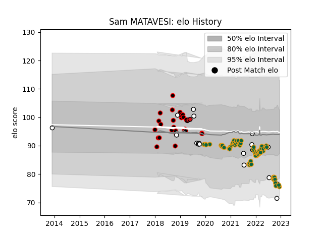

---  
layout: page  
title: Sam MATAVESI  
date: 2023-03-12 11:32:57.110009  
categories: player  
---
# Sam MATAVESI

## Positions: H

## Country: Fiji

## Current elo: 76.0

## Current Percentile: 8.0

# Elo History

# Match History

| Team               |   Appearances |   Win Rate |
|:-------------------|--------------:|-----------:|
| Northampton Saints |            61 |   0.442623 |
| Cornish Pirates    |            28 |   0.464286 |
| Fiji               |            19 |   0.394737 |
| Stade Toulousain   |             3 |   1        |

| Opponent            |   Matches |   Win Rate |
|:--------------------|----------:|-----------:|
| Wasps               |         7 |   0.714286 |
| London Irish        |         6 |   0.666667 |
| Gloucester Rugby    |         6 |   0.333333 |
| Exeter Chiefs       |         5 |   0.4      |
| Bath Rugby          |         5 |   0.4      |
| Worcester Warriors  |         5 |   1        |
| Leicester Tigers    |         5 |   0.2      |
| Newcastle Falcons   |         4 |   0.75     |
| Sale Sharks         |         4 |   0        |
| London Scottish     |         3 |   0.666667 |
| Nottingham          |         3 |   0.333333 |
| Harlequins          |         3 |   0        |
| Hartpury College    |         3 |   1        |
| Bristol Rugby       |         3 |   0.666667 |
| Jersey              |         3 |   0        |
| Scotland            |         2 |   0        |
| Saracens            |         2 |   0        |
| Tonga               |         2 |   1        |
| Richmond            |         2 |   1        |
| Ulster              |         2 |   0        |
| New Zealand Maori   |         2 |   0.5      |
| Wales               |         2 |   0        |
| New Zealand         |         2 |   0        |
| Yorkshire Carnegie  |         2 |   0.5      |
| Coventry            |         2 |   0.5      |
| Bedford             |         2 |   0        |
| Georgia             |         2 |   0.75     |
| Ealing Trailfinders |         2 |   0        |
| Leinster            |         2 |   0        |
| Doncaster           |         2 |   1        |
| Australia           |         1 |   0        |
| Benetton Treviso    |         1 |   1        |
| Bordeaux Begles     |         1 |   0        |
| Uruguay             |         1 |   0        |
| Castres Olympique   |         1 |   1        |
| Clermont Auvergne   |         1 |   1        |
| Spain               |         1 |   1        |
| Samoa               |         1 |   0        |
| Rotherham Titans    |         1 |   0        |
| Romania             |         1 |   1        |
| France              |         1 |   1        |
| Racing 92           |         1 |   0        |
| Perpignan           |         1 |   1        |
| Ireland             |         1 |   0        |
| La Rochelle         |         1 |   0        |
| Ampthill            |         1 |   1        |