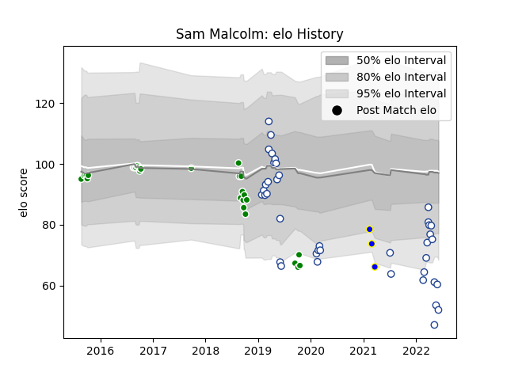

---  
layout: page  
title: Sam Malcolm  
date: 2023-03-21 18:25:41.926098  
categories: player  
---
# Sam Malcolm

Last updated: 2023-03-21
## Positions: FH, FB

## Current elo: 52.0

## Current Percentile: 3.0

# Elo History

# Match History

| Team              |   Appearances |   Win Rate |
|:------------------|--------------:|-----------:|
| Toronto Arrows    |            40 |   0.6      |
| Manawatu          |            29 |   0.448276 |
| Kamaishi Seawaves |             3 |   0.666667 |

| Opponent               |   Matches |   Win Rate |
|:-----------------------|----------:|-----------:|
| Old Glory DC           |         4 |   0.75     |
| Northland              |         4 |   0.75     |
| Bay of Plenty          |         4 |   0.25     |
| Seattle Seawolves      |         4 |   0.5      |
| Houston SaberCats      |         4 |   0.75     |
| Rugby New York         |         4 |   0.5      |
| NOLA Gold              |         4 |   0.5      |
| R.U. New York          |         4 |   0.5      |
| Waikato                |         3 |   0.333333 |
| Utah Warriors          |         3 |   1        |
| Taranaki               |         3 |   0        |
| Southland              |         3 |   1        |
| Rugby ATL              |         3 |   0.333333 |
| Wellington             |         3 |   0.666667 |
| New England Free Jacks |         3 |   0.333333 |
| North Harbour          |         2 |   0.5      |
| San Diego Legion       |         2 |   1        |
| Hawke's Bay            |         2 |   0        |
| Glendale Raptors       |         2 |   0.5      |
| Canterbury             |         2 |   0.5      |
| Austin Herd            |         1 |   1        |
| Otago                  |         1 |   0        |
| Kurita Water Gush      |         1 |   1        |
| Shimizu Blue Sharks    |         1 |   0        |
| Skyactivs Hiroshima    |         1 |   1        |
| Counties Manukau       |         1 |   1        |
| Tasman                 |         1 |   0        |
| Colorado Raptors       |         1 |   0        |
| Austin Elite Rugby     |         1 |   1        |