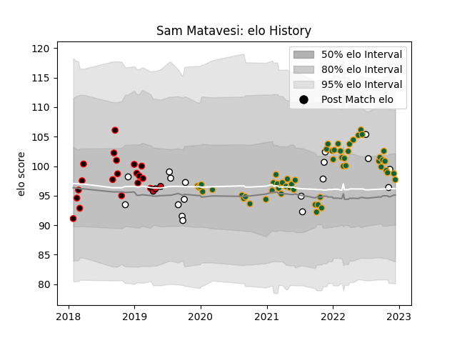

---  
layout: page  
title: Sam Matavesi  
date: 2022-12-18 16:30:07.517528  
categories: player  
---
# Sam Matavesi

## Positions: H

## Country: Fiji

## Current elo: 96.0

## Current Percentile: 65.0

# Elo History

# Match History

| Team               |   Appearances |   Win Rate |
|:-------------------|--------------:|-----------:|
| Northampton Saints |            57 |   0.491228 |
| Cornish Pirates    |            19 |   0.578947 |
| Fiji               |            18 |   0.361111 |
| Stade Toulousain   |             3 |   1        |

| Opponent            |   Matches |   Win Rate |
|:--------------------|----------:|-----------:|
| Wasps               |         7 |   0.714286 |
| London Irish        |         5 |   0.8      |
| Bath Rugby          |         5 |   0.4      |
| Leicester Tigers    |         5 |   0.2      |
| Gloucester Rugby    |         5 |   0.4      |
| Exeter Chiefs       |         5 |   0.4      |
| Worcester Warriors  |         5 |   1        |
| Sale Sharks         |         4 |   0        |
| Newcastle Falcons   |         4 |   0.75     |
| Bristol Rugby       |         4 |   0.75     |
| Harlequins          |         3 |   0        |
| Hartpury College    |         3 |   1        |
| Tonga               |         2 |   1        |
| Scotland            |         2 |   0        |
| Saracens            |         2 |   0        |
| Wales               |         2 |   0        |
| Richmond            |         2 |   1        |
| New Zealand Maori   |         2 |   0.5      |
| New Zealand         |         2 |   0        |
| London Scottish     |         2 |   1        |
| Yorkshire Carnegie  |         2 |   0.5      |
| Doncaster           |         2 |   1        |
| Georgia             |         2 |   0.75     |
| Ealing Trailfinders |         2 |   0        |
| Coventry            |         2 |   0.5      |
| Leinster            |         1 |   0        |
| Bedford             |         1 |   0        |
| Benetton Treviso    |         1 |   1        |
| Castres Olympique   |         1 |   1        |
| Uruguay             |         1 |   0        |
| Clermont Auvergne   |         1 |   1        |
| Spain               |         1 |   1        |
| Samoa               |         1 |   0        |
| Munster             |         1 |   0        |
| Rotherham Titans    |         1 |   0        |
| France              |         1 |   1        |
| Perpignan           |         1 |   1        |
| Nottingham          |         1 |   0        |
| Ireland             |         1 |   0        |
| La Rochelle         |         1 |   0        |
| Australia           |         1 |   0        |