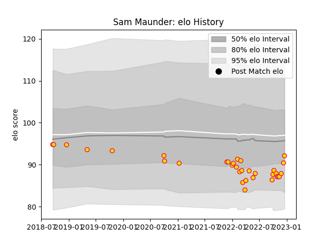

---  
layout: page  
title: Sam Maunder  
date: 2022-12-18 16:28:24.187805  
categories: player  
---
# Sam Maunder

## Positions: SH

## Current elo: 92.0

## Current Percentile: 25.0

# Elo History

# Match History

| Team          |   Appearances |   Win Rate |
|:--------------|--------------:|-----------:|
| Exeter Chiefs |            33 |   0.515152 |

| Opponent           |   Matches |   Win Rate |
|:-------------------|----------:|-----------:|
| Bristol Rugby      |         4 |   0.5      |
| Harlequins         |         4 |   0.75     |
| Saracens           |         4 |   0.25     |
| London Irish       |         3 |   0.333333 |
| Newcastle Falcons  |         3 |   0.666667 |
| Sale Sharks        |         3 |   0.666667 |
| Bath Rugby         |         2 |   1        |
| Gloucester Rugby   |         2 |   0.5      |
| Northampton Saints |         2 |   0.5      |
| Wasps              |         2 |   0        |
| Bulls              |         1 |   1        |
| Castres Olympique  |         1 |   1        |
| Leicester Tigers   |         1 |   0        |
| Worcester Warriors |         1 |   0        |