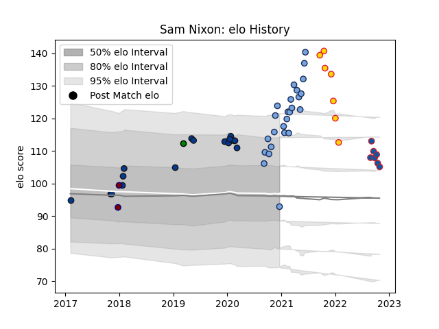

---  
layout: page  
title: Sam Nixon  
date: 2023-03-21 18:55:43.509765  
categories: player  
---
# Sam Nixon

Last updated: 2023-03-21
## Positions: P

## Current elo: 93.0

## Current Percentile: 96.0

# Elo History

# Match History

| Team               |   Appearances |   Win Rate |
|:-------------------|--------------:|-----------:|
| Bayonne            |            25 |   0.42     |
| Bath Rugby         |            16 |   0.6875   |
| Exeter Chiefs      |             7 |   0.428571 |
| Grenoble           |             7 |   0.714286 |
| Rotherham Titans   |             2 |   0        |
| Yorkshire Carnegie |             1 |   1        |

| Opponent             |   Matches |   Win Rate |
|:---------------------|----------:|-----------:|
| Leicester Tigers     |         5 |   0.6      |
| Agen                 |         3 |   1        |
| Clermont Auvergne    |         3 |   0.333333 |
| Wasps                |         3 |   1        |
| Montpellier Herault  |         3 |   0.333333 |
| London Irish         |         3 |   0.666667 |
| Stade Toulousain     |         2 |   0.5      |
| Castres Olympique    |         2 |   0        |
| Newcastle Falcons    |         2 |   0.5      |
| Brive                |         2 |   0.5      |
| Toulon               |         2 |   1        |
| Harlequins           |         2 |   0.5      |
| Pau                  |         2 |   0        |
| La Rochelle          |         2 |   0        |
| Stade Francais Paris |         2 |   0.5      |
| Rouen                |         1 |   1        |
| Racing 92            |         1 |   1        |
| Bristol Rugby        |         1 |   1        |
| Saracens             |         1 |   1        |
| Ulster               |         1 |   0        |
| Vannes               |         1 |   0        |
| Benetton Treviso     |         1 |   1        |
| Provence Rugby       |         1 |   0        |
| Nevers               |         1 |   1        |
| Ospreys              |         1 |   1        |
| Beziers              |         1 |   1        |
| Lyon                 |         1 |   0        |
| Aurillac             |         1 |   1        |
| Biarritz Olympique   |         1 |   0.5      |
| Hartpury College     |         1 |   0        |
| Glasgow Warriors     |         1 |   0        |
| Exeter Chiefs        |         1 |   0        |
| Doncaster            |         1 |   0        |
| Bordeaux Begles      |         1 |   0        |
| Worcester Warriors   |         1 |   1        |