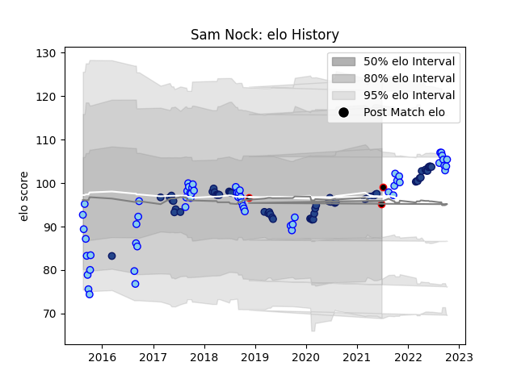

---  
layout: page  
title: Sam Nock  
date: 2023-03-30 11:31:23.104745  
categories: player  
---
# Sam Nock

Last updated: 2023-03-30
## Positions: SH

## Country: New Zealand Maori

## Current elo: 95.0

## Current Percentile: 52.0

# Elo History

# Match History

| Team              |   Appearances |   Win Rate |
|:------------------|--------------:|-----------:|
| Northland         |            58 |   0.241379 |
| Blues             |            56 |   0.669643 |
| New Zealand Maori |             3 |   1        |

| Opponent                 |   Matches |   Win Rate |
|:-------------------------|----------:|-----------:|
| Chiefs                   |        10 |   0.55     |
| Hurricanes               |         8 |   0.5      |
| Highlanders              |         8 |   0.75     |
| Manawatu                 |         6 |   0.333333 |
| Otago                    |         6 |   0.333333 |
| Bay of Plenty            |         6 |   0.166667 |
| Wellington               |         6 |   0.166667 |
| Auckland                 |         5 |   0.2      |
| Waikato                  |         5 |   0.4      |
| Southland                |         5 |   0.6      |
| Brumbies                 |         4 |   0.75     |
| New South Wales Waratahs |         4 |   1        |
| North Harbour            |         4 |   0        |
| Canterbury               |         4 |   0        |
| Stormers                 |         3 |   0.333333 |
| Melbourne Rebels         |         3 |   1        |
| Hawke's Bay              |         3 |   0.333333 |
| Tasman                   |         3 |   0        |
| Taranaki                 |         3 |   0.333333 |
| Queensland Reds          |         3 |   1        |
| Sunwolves                |         3 |   0.666667 |
| Crusaders                |         3 |   0        |
| Samoa                    |         2 |   1        |
| Counties Manukau         |         2 |   0        |
| Lions                    |         2 |   1        |
| Bulls                    |         1 |   1        |
| Sharks                   |         1 |   0        |
| British and Irish Lions  |         1 |   1        |
| Chile                    |         1 |   1        |
| Moana Pasifika           |         1 |   1        |
| Cheetahs                 |         1 |   1        |