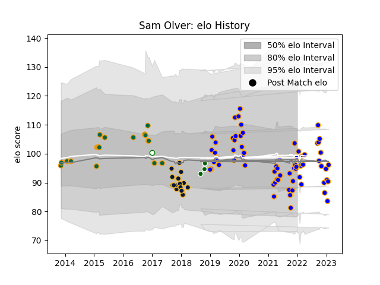

---  
layout: page  
title: Sam Olver  
date: 2023-01-13 11:30:30.173497  
categories: player  
---
# Sam Olver

## Positions: FH

## Current elo: 99.0

## Current Percentile: 43.0

# Elo History

# Match History

| Team                |   Appearances |   Win Rate |
|:--------------------|--------------:|-----------:|
| Doncaster           |            64 |   0.640625 |
| Northampton Saints  |            20 |   0.675    |
| Worcester Warriors  |            19 |   0.289474 |
| Ealing Trailfinders |             3 |   0.333333 |
| Nottingham          |             1 |   0        |

| Opponent            |   Matches |   Win Rate |
|:--------------------|----------:|-----------:|
| Coventry            |         9 |   0.444444 |
| Jersey              |         7 |   0.571429 |
| Nottingham          |         7 |   0.571429 |
| Cornish Pirates     |         7 |   0.285714 |
| Bedford             |         6 |   0.666667 |
| Hartpury College    |         6 |   1        |
| Ealing Trailfinders |         5 |   0.4      |
| Richmond            |         5 |   1        |
| London Scottish     |         5 |   1        |
| Ampthill            |         5 |   0.8      |
| Exeter Chiefs       |         4 |   0.5      |
| Harlequins          |         4 |   0.5      |
| Saracens            |         4 |   0        |
| Leicester Tigers    |         4 |   0.25     |
| London Irish        |         4 |   0.75     |
| Gloucester Rugby    |         4 |   0.875    |
| Newcastle Falcons   |         3 |   0.333333 |
| Oyonnax             |         2 |   0.5      |
| Wasps               |         2 |   0.5      |
| Sale Sharks         |         2 |   0        |
| Yorkshire Carnegie  |         2 |   0.5      |
| Connacht            |         2 |   0.25     |
| Bath Rugby          |         2 |   0.5      |
| Dragons             |         2 |   0.5      |
| Caldy               |         1 |   1        |
| Brive               |         1 |   0        |
| Worcester Warriors  |         1 |   1        |
| Northampton Saints  |         1 |   1        |