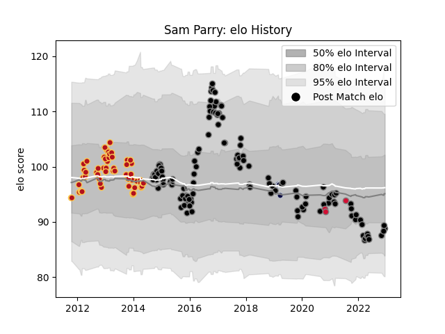

---  
layout: page  
title: Sam Parry  
date: 2022-12-14 11:35:36.844503  
categories: player  
---
# Sam Parry

## Positions: H

## Country: Wales

## Current elo: 89.0

## Current Percentile: 22.0

# Elo History

# Match History

| Team          |   Appearances |   Win Rate |
|:--------------|--------------:|-----------:|
| Ospreys       |           126 |   0.527778 |
| Dragons       |            57 |   0.377193 |
| Bristol Rugby |             4 |   0.5      |
| Wales         |             3 |   0        |

| Opponent             |   Matches |   Win Rate |
|:---------------------|----------:|-----------:|
| Munster              |        14 |  0.214286  |
| Connacht             |        14 |  0.357143  |
| Cardiff Blues        |        13 |  0.846154  |
| Leinster             |        12 |  0.0833333 |
| Edinburgh            |        12 |  0.75      |
| Dragons              |        12 |  0.708333  |
| Zebre                |        11 |  0.954545  |
| Benetton Treviso     |        11 |  0.636364  |
| Ulster               |        10 |  0.3       |
| Scarlets             |         9 |  0.444444  |
| Glasgow Warriors     |         8 |  0.4375    |
| Ospreys              |         7 |  0.142857  |
| Bordeaux Begles      |         4 |  0.5       |
| Mogliano             |         4 |  1         |
| Southern Kings       |         3 |  0.666667  |
| Worcester Warriors   |         3 |  0.333333  |
| Wasps                |         3 |  0.333333  |
| Clermont Auvergne    |         3 |  0.333333  |
| Northampton Saints   |         3 |  0.333333  |
| Racing 92            |         2 |  0.25      |
| Bulls                |         2 |  0         |
| Saracens             |         2 |  0         |
| Sharks               |         2 |  0         |
| Stade Francais Paris |         2 |  0         |
| Bath Rugby           |         2 |  0         |
| Lyon                 |         2 |  1         |
| Cheetahs             |         2 |  0.5       |
| Exeter Chiefs        |         2 |  0.5       |
| Castres Olympique    |         1 |  1         |
| London Welsh         |         1 |  1         |
| Cavalieri Prato      |         1 |  1         |
| Bayonne              |         1 |  0         |
| Stormers             |         1 |  0         |
| France               |         1 |  0         |
| Gloucester Rugby     |         1 |  1         |
| Scotland             |         1 |  0         |
| Grenoble             |         1 |  1         |
| Harlequins           |         1 |  0         |
| Leicester Tigers     |         1 |  0         |
| Pau                  |         1 |  0         |
| Argentina            |         1 |  0         |
| Lions                |         1 |  0         |
| Newcastle Falcons    |         1 |  1         |
| Aironi               |         1 |  1         |