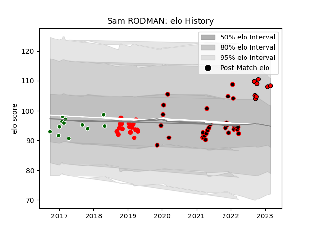

---  
layout: page  
title: Sam RODMAN  
date: 2023-03-30 11:35:03.350735  
categories: player  
---
# Sam RODMAN

Last updated: 2023-03-30
## Positions: P

## Current elo: 111.0

## Current Percentile: 92.0

# Elo History

# Match History

| Team                |   Appearances |   Win Rate |
|:--------------------|--------------:|-----------:|
| Cornish Pirates     |            29 |   0.741379 |
| Jersey              |            18 |   0.611111 |
| Ealing Trailfinders |            12 |   0.541667 |
| Hartpury College    |            11 |   0.363636 |

| Opponent            |   Matches |   Win Rate |
|:--------------------|----------:|-----------:|
| Doncaster           |         7 |   0.571429 |
| Nottingham          |         7 |   0.857143 |
| Richmond            |         7 |   0.785714 |
| Bedford             |         6 |   0.5      |
| Jersey              |         6 |   0.5      |
| Ampthill            |         5 |   0.6      |
| Cornish Pirates     |         5 |   0.6      |
| Hartpury College    |         5 |   0.8      |
| Ealing Trailfinders |         4 |   0        |
| London Irish        |         4 |   0.25     |
| London Scottish     |         4 |   0.5      |
| Yorkshire Carnegie  |         4 |   0.625    |
| Coventry            |         2 |   1        |
| Rotherham Titans    |         2 |   1        |
| Caldy               |         1 |   1        |
| Saracens            |         1 |   1        |