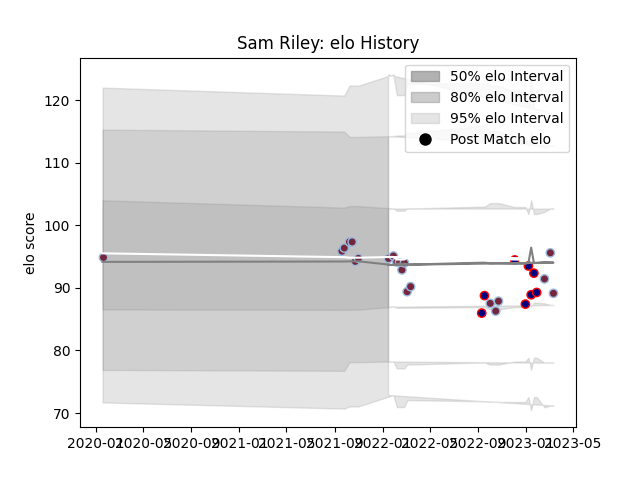

---  
layout: page  
title: Sam Riley  
date: 2022-12-12 15:08:03.296869  
categories: player  
---
# Sam Riley

## Positions: H

## Current elo: 97.0

## Current Percentile: 35.0

# Elo History

# Match History

| Team            |   Appearances |   Win Rate |
|:----------------|--------------:|-----------:|
| Harlequins      |            17 |   0.588235 |
| London Scottish |             3 |   0.333333 |

| Opponent           |   Matches |   Win Rate |
|:-------------------|----------:|-----------:|
| Sale Sharks        |         3 |   0.333333 |
| Bath Rugby         |         2 |   0.5      |
| Bristol Rugby      |         2 |   1        |
| Newcastle Falcons  |         2 |   1        |
| Saracens           |         2 |   0        |
| Worcester Warriors |         2 |   1        |
| Bedford            |         1 |   0        |
| Caldy              |         1 |   1        |
| Clermont Auvergne  |         1 |   0        |
| Leicester Tigers   |         1 |   0        |
| Northampton Saints |         1 |   1        |
| Nottingham         |         1 |   0        |
| Wasps              |         1 |   1        |