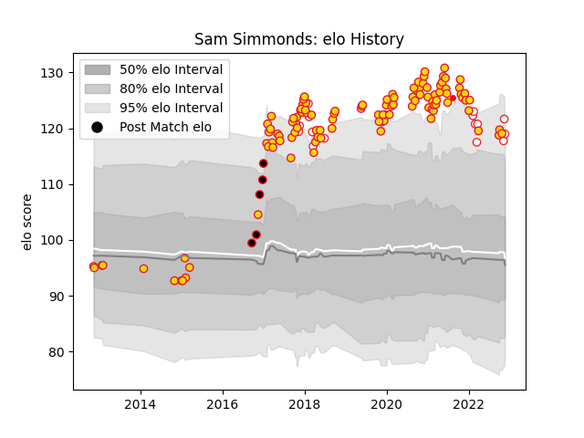

---  
layout: page  
title: Sam Simmonds  
date: 2022-11-15 23:38:24.253359  
categories: player  
---
# Sam Simmonds

## Positions: N8, FL

## Country: England

## Current elo: 121.0

## Current Percentile: 92.0

# Elo History

# Match History

| Team                    |   Appearances |   Win Rate |
|:------------------------|--------------:|-----------:|
| Exeter Chiefs           |           113 |   0.756637 |
| England                 |            17 |   0.647059 |
| Cornish Pirates         |             5 |   0.8      |
| British and Irish Lions |             1 |   0        |

| Opponent            |   Matches |   Win Rate |
|:--------------------|----------:|-----------:|
| Sale Sharks         |        11 |   0.727273 |
| Wasps               |        10 |   0.85     |
| Bath Rugby          |         9 |   0.777778 |
| Leicester Tigers    |         9 |   0.777778 |
| Gloucester Rugby    |         8 |   0.75     |
| Saracens            |         8 |   0.5      |
| Northampton Saints  |         8 |   0.875    |
| Harlequins          |         8 |   0.625    |
| London Irish        |         7 |   0.714286 |
| Newcastle Falcons   |         7 |   0.714286 |
| Worcester Warriors  |         7 |   1        |
| Bristol Rugby       |         5 |   0.6      |
| Glasgow Warriors    |         3 |   0.666667 |
| South Africa        |         3 |   0.666667 |
| Montpellier Herault |         2 |   1        |
| Wales               |         2 |   1        |
| Ospreys             |         2 |   1        |
| Ireland             |         2 |   0        |
| Nottingham          |         2 |   1        |
| Argentina           |         2 |   0.5      |
| Italy               |         2 |   1        |
| Leinster            |         2 |   0        |
| France              |         2 |   0        |
| La Rochelle         |         2 |   1        |
| Australia           |         2 |   1        |
| Cardiff Blues       |         1 |   1        |
| Japan               |         1 |   1        |
| Stade Toulousain    |         1 |   1        |
| Scotland            |         1 |   0        |
| London Welsh        |         1 |   1        |
| Samoa               |         1 |   1        |
| Rotherham Titans    |         1 |   0        |
| Racing 92           |         1 |   1        |
| Dragons             |         1 |   1        |
| Ealing Trailfinders |         1 |   1        |
| Doncaster           |         1 |   1        |