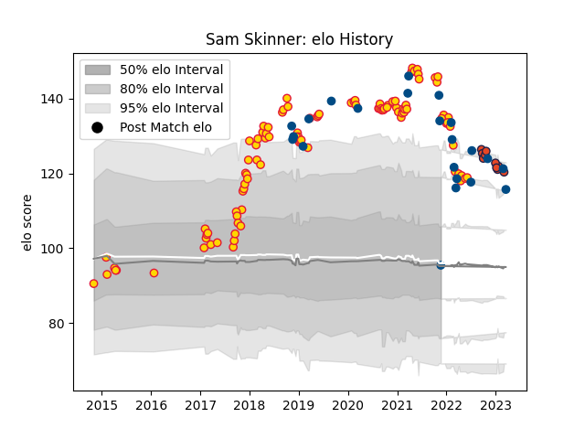

---  
layout: page  
title: Sam Skinner  
date: 2023-01-01 11:19:08.846696  
categories: player  
---
# Sam Skinner

## Positions: L, FL

## Country: Scotland

## Current elo: 95.0

## Current Percentile: 94.0

# Elo History

# Match History

| Team          |   Appearances |   Win Rate |
|:--------------|--------------:|-----------:|
| Exeter Chiefs |            99 |   0.747475 |
| Scotland      |            20 |   0.625    |
| Edinburgh     |             6 |   0.5      |

| Opponent           |   Matches |   Win Rate |
|:-------------------|----------:|-----------:|
| Northampton Saints |        12 |   0.833333 |
| Gloucester Rugby   |        11 |   0.727273 |
| Bath Rugby         |         9 |   1        |
| Saracens           |         7 |   0.428571 |
| Wasps              |         7 |   0.785714 |
| Bristol Rugby      |         7 |   0.714286 |
| Newcastle Falcons  |         7 |   1        |
| Sale Sharks        |         7 |   0.714286 |
| Harlequins         |         6 |   0.666667 |
| Worcester Warriors |         6 |   1        |
| London Irish       |         5 |   0.6      |
| Leicester Tigers   |         5 |   0.6      |
| France             |         4 |   0.75     |
| Italy              |         3 |   1        |
| Argentina          |         3 |   0.666667 |
| Australia          |         2 |   0.5      |
| England            |         2 |   0.75     |
| Leinster           |         2 |   0        |
| Dragons            |         2 |   1        |
| Munster            |         2 |   0.25     |
| South Africa       |         2 |   0        |
| Scarlets           |         1 |   1        |
| Stade Toulousain   |         1 |   1        |
| Stormers           |         1 |   0        |
| Wales              |         1 |   0        |
| Japan              |         1 |   1        |
| Racing 92          |         1 |   1        |
| Ireland            |         1 |   0        |
| Glasgow Warriors   |         1 |   0        |
| Fiji               |         1 |   1        |
| Castres Olympique  |         1 |   1        |
| Bulls              |         1 |   0        |
| Bordeaux Begles    |         1 |   0        |
| Benetton Treviso   |         1 |   1        |
| Zebre              |         1 |   1        |