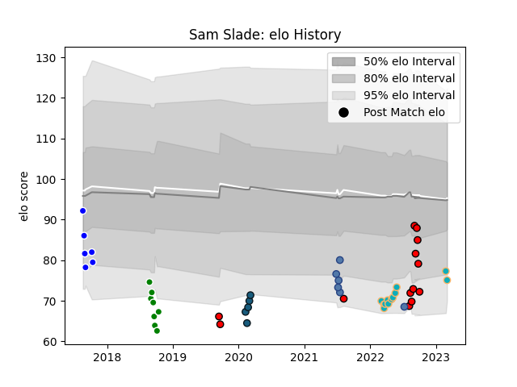

---  
layout: page  
title: Sam Slade  
date: 2023-03-09 10:08:41.188753  
categories: player  
---
# Sam Slade

## Positions: L, FL

## Country: Samoa

## Current elo: 79.0

## Current Percentile: 7.0

# Elo History

# Match History

| Team             |   Appearances |   Win Rate |
|:-----------------|--------------:|-----------:|
| Counties Manukau |            13 |   0.230769 |
| Moana Pasifika   |            10 |   0.2      |
| Manawatu         |             8 |   0.125    |
| Auckland         |             6 |   0.166667 |
| Samoa            |             6 |   0.666667 |
| Colorado Raptors |             5 |   0.4      |

| Opponent                 |   Matches |   Win Rate |
|:-------------------------|----------:|-----------:|
| Tonga                    |         4 |   1        |
| Canterbury               |         3 |   0        |
| Southland                |         3 |   0.333333 |
| Wellington               |         2 |   0        |
| Hurricanes               |         2 |   0.5      |
| Northland                |         2 |   0.5      |
| North Harbour            |         2 |   0        |
| New Zealand Maori        |         2 |   0        |
| Taranaki                 |         2 |   0        |
| Manawatu                 |         2 |   0.5      |
| Tasman                   |         2 |   0        |
| Hawke's Bay              |         2 |   0        |
| Chiefs                   |         2 |   0        |
| Waikato                  |         2 |   0        |
| Otago                    |         2 |   0.5      |
| Queensland Reds          |         1 |   0        |
| Toronto Arrows           |         1 |   1        |
| San Diego Legion         |         1 |   0        |
| Utah Warriors            |         1 |   1        |
| Auckland                 |         1 |   0        |
| Bay of Plenty            |         1 |   1        |
| NOLA Gold                |         1 |   0        |
| Melbourne Rebels         |         1 |   0        |
| Houston SaberCats        |         1 |   0        |
| Highlanders              |         1 |   0        |
| Crusaders                |         1 |   0        |
| Counties Manukau         |         1 |   0        |
| Brumbies                 |         1 |   1        |
| New South Wales Waratahs |         1 |   0        |