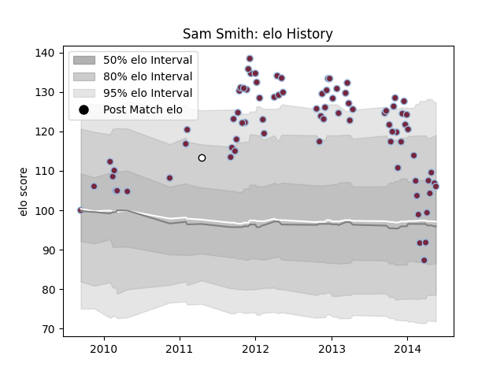

---  
layout: page  
title: Sam Smith  
date: 2022-12-18 16:15:31.242718  
categories: player  
---
# Sam Smith

## Positions: W

## Current elo: 111.0

## Current Percentile: 89.0

# Elo History

# Match History

| Team       |   Appearances |   Win Rate |
|:-----------|--------------:|-----------:|
| Harlequins |            81 |   0.691358 |
| Esher      |             1 |   1        |

| Opponent             |   Matches |   Win Rate |
|:---------------------|----------:|-----------:|
| Northampton Saints   |         9 |   0.555556 |
| Bath Rugby           |         7 |   0.714286 |
| Sale Sharks          |         7 |   0.857143 |
| London Irish         |         7 |   0.714286 |
| Gloucester Rugby     |         6 |   0.5      |
| Leicester Tigers     |         6 |   0.5      |
| Worcester Warriors   |         5 |   1        |
| Newcastle Falcons    |         5 |   1        |
| Exeter Chiefs        |         4 |   0.75     |
| Wasps                |         4 |   1        |
| Saracens             |         4 |   0.25     |
| Connacht             |         3 |   0.666667 |
| Cardiff Blues        |         3 |   0.333333 |
| Zebre                |         2 |   1        |
| Racing 92            |         2 |   1        |
| London Welsh         |         2 |   1        |
| Pertemps Bees        |         1 |   1        |
| Scarlets             |         1 |   0        |
| Stade Francais Paris |         1 |   1        |
| Stade Toulousain     |         1 |   0        |
| Clermont Auvergne    |         1 |   0        |
| Ospreys              |         1 |   1        |