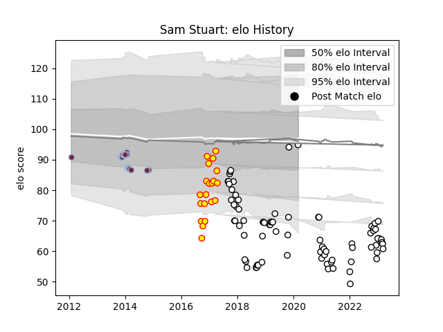

---  
layout: page  
title: Sam Stuart  
date: 2022-12-18 16:15:12.159810  
categories: player  
---
# Sam Stuart

## Positions: SH

## Current elo: 71.0

## Current Percentile: 1.0

# Elo History

# Match History

| Team              |   Appearances |   Win Rate |
|:------------------|--------------:|-----------:|
| Newcastle Falcons |            69 |   0.478261 |
| Richmond          |            19 |   0.263158 |
| Harlequins        |            18 |   0.444444 |

| Opponent            |   Matches |   Win Rate |
|:--------------------|----------:|-----------:|
| Gloucester Rugby    |         8 |   0.375    |
| Bath Rugby          |         7 |   0.428571 |
| Northampton Saints  |         7 |   0.571429 |
| Exeter Chiefs       |         7 |   0.142857 |
| Leicester Tigers    |         6 |   0.166667 |
| Saracens            |         6 |   0        |
| London Irish        |         6 |   0.333333 |
| Worcester Warriors  |         5 |   0.8      |
| Wasps               |         5 |   0.4      |
| Sale Sharks         |         4 |   0.75     |
| Bristol Rugby       |         4 |   0.25     |
| Cardiff Blues       |         4 |   0.25     |
| Cornish Pirates     |         3 |   1        |
| Dragons             |         3 |   1        |
| London Scottish     |         3 |   0.666667 |
| Nottingham          |         2 |   0.5      |
| Bordeaux Begles     |         2 |   1        |
| Newcastle Falcons   |         2 |   1        |
| Harlequins          |         2 |   0.5      |
| Jersey              |         2 |   0        |
| Rotherham Titans    |         2 |   0        |
| Edinburgh           |         2 |   0        |
| Ealing Trailfinders |         2 |   0        |
| Doncaster           |         2 |   0        |
| RC Enisei           |         2 |   1        |
| Scarlets            |         1 |   1        |
| Hartpury College    |         1 |   1        |
| London Welsh        |         1 |   0        |
| Bedford             |         1 |   1        |
| Connacht            |         1 |   0        |
| Castres Olympique   |         1 |   1        |
| Brive               |         1 |   1        |
| Yorkshire Carnegie  |         1 |   0        |