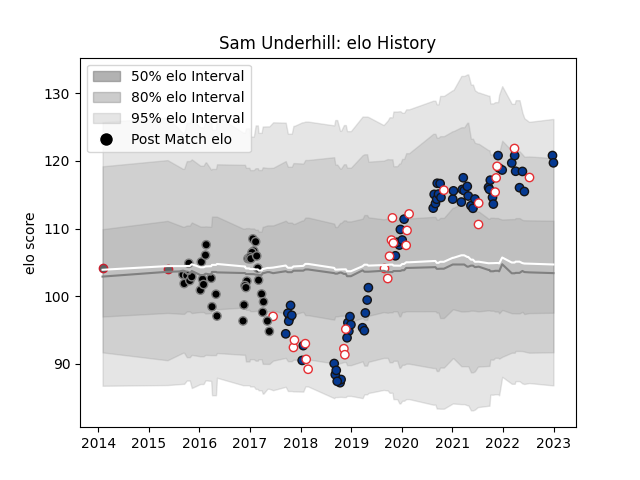

---  
layout: page  
title: Sam Underhill  
date: 2023-01-06 00:10:05.213476  
categories: player  
---
# Sam Underhill

## Positions: FL

## Country: England

## Current elo: 120.0

## Current Percentile: 90.0

# Elo History

# Match History

| Team             |   Appearances |   Win Rate |
|:-----------------|--------------:|-----------:|
| Bath Rugby       |            65 |   0.407692 |
| Ospreys          |            37 |   0.581081 |
| England          |            26 |   0.807692 |
| Gloucester Rugby |             2 |   0.5      |

| Opponent                 |   Matches |   Win Rate |
|:-------------------------|----------:|-----------:|
| Wasps                    |         8 |   0.5625   |
| Gloucester Rugby         |         7 |   0.214286 |
| Exeter Chiefs            |         7 |   0        |
| Sale Sharks              |         6 |   0.333333 |
| Scarlets                 |         5 |   0.4      |
| Australia                |         5 |   1        |
| Bristol Rugby            |         5 |   0.6      |
| Ulster                   |         4 |   0        |
| Leicester Tigers         |         4 |   0.75     |
| Edinburgh                |         4 |   0.75     |
| Benetton Treviso         |         4 |   0.75     |
| Northampton Saints       |         4 |   0.5      |
| Newcastle Falcons        |         4 |   0.75     |
| Worcester Warriors       |         4 |   0.75     |
| Munster                  |         4 |   0.25     |
| Harlequins               |         4 |   0.25     |
| London Irish             |         4 |   0.75     |
| Leinster                 |         4 |   0        |
| Saracens                 |         3 |   0.166667 |
| Argentina                |         3 |   1        |
| Glasgow Warriors         |         3 |   0.833333 |
| Scotland                 |         2 |   0.5      |
| Connacht                 |         2 |   0.5      |
| Cardiff Blues            |         2 |   1        |
| Tonga                    |         2 |   1        |
| South Africa             |         2 |   0.5      |
| Italy                    |         2 |   1        |
| Clermont Auvergne        |         2 |   0.5      |
| Zebre                    |         2 |   1        |
| Dragons                  |         2 |   1        |
| France                   |         2 |   0        |
| New Zealand              |         2 |   0.5      |
| Grenoble                 |         2 |   1        |
| Ireland                  |         2 |   1        |
| Stade Francais Paris     |         1 |   0        |
| Stade Toulousain         |         1 |   0        |
| Lyon                     |         1 |   1        |
| United States of America |         1 |   1        |
| Wales                    |         1 |   1        |
| Canada                   |         1 |   1        |
| Bath Rugby               |         1 |   0        |
| Japan                    |         1 |   1        |